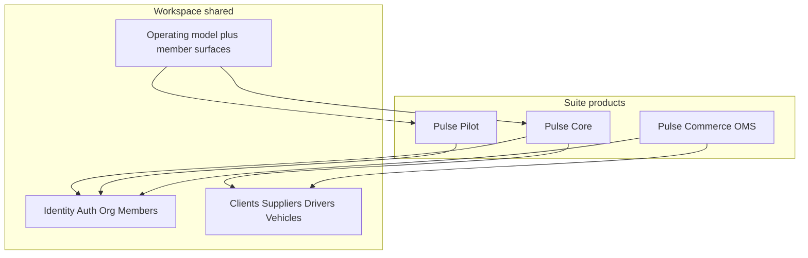

# Pulse Domain Structure & Organizational Audit

**Status:** Current-state blueprint for folder ownership and team assignment.  
**Scope:** Inventory and mapping only — no folder moves or RBAC changes in this document.

**What Pulse is:** Multi-tenant logistics OS (Expo web + native) on one Supabase project. Three suite surfaces: **Core** (`/`), **Pilot** driver (`/(driver)`), **Commerce/OMS** (`/oms`). Feature code lives under `features/` (domain modules); routes stay thin in `app/`.

**Related docs**

| Topic | Path |
|-------|------|
| Feature folder standard | [FEATURES_ARCHITECTURE.md](./FEATURES_ARCHITECTURE.md) |
| Operating model RBAC | [RBAC_OPERATING_MODEL.md](./RBAC_OPERATING_MODEL.md) |
| Architecture overview | [architecture.md](./architecture.md) |
| Product registry (target) | [architecture/platform/08-product-registry.md](./architecture/platform/08-product-registry.md) |
| Customer / Warehouse / Org ownership | [architecture/07-domain-ownership-audit.md](./architecture/07-domain-ownership-audit.md) |
| Admin console (platform ops — designed) | [ADMIN_CONSOLE_DESIGN_SPEC.md](./ADMIN_CONSOLE_DESIGN_SPEC.md) |

---

## Suite overview



| Suite product | App base | Tagline |
|---------------|----------|---------|
| Pulse Core | `/` | Transport operating system |
| Pulse Pilot | `/(driver)` | Driver app |
| Pulse Commerce | `/oms` | Catalog, inventory, orders & planning |

---

## 1. User types / personas

Two axes gate access: **(A) org operating model** (Asset / Aggregate / Hybrid) and **(B) member platform role + surfaces**. Driver is a separate app experience (`profiles.role === 'driver'`).

| Persona | Primary goals | Permission level | Key workflows |
|---------|---------------|------------------|---------------|
| **Org Owner** | Run company on Pulse; set model; invite team; transfer ownership | Full within org model; only role that can change `operating_model` / transfer ownership | Onboarding, workspace settings, KYC, member permissions, products |
| **Org Admin** | Same day-to-day as owner without ownership/model transfer | Full nav ∩ org model; not owner-only RPCs | Finance, trips, network, fleet, team invite (non-owner paths) |
| **Finance member** | Cash, party ledgers, invoicing, POD money trail | `domains.finance` + surfaces under `finance.*` | Fiscal tab, add/edit transactions, invoicing, shared/trip ledger, reports |
| **Sales member** | Grow counterparties and marketplace | `domains.sales` + `sales.*` | Network, clients/suppliers CRM, connect/discover, load board, chat |
| **TripOps / Dispatcher** | Plan and execute transport work | `domains.tripops` + `tripops.*` (+ fleet surfaces when Asset/Hybrid) | Trips list/create/assign, indents/give-load, tracking, trip expenses/docs |
| **Fleet operator** (often same user as TripOps on Asset/Hybrid) | Own trucks and drivers | Surfaces `fleet.*`; blocked on Aggregate | Vehicles/drivers CRUD, garage finance, assign vehicle, Pilot invites |
| **Driver (Pilot)** | Execute assigned trips on road | Pilot stack only; not Core tabs | Dashboard, trip control, expenses/fuel/POD, wallet, history, profile |
| **Counterparty org user** | Not a persona inside *your* tenant — another org on Network | Their own workspace; connection roles `client` / `supplier` | Shared ledger, bids, chat, subcontracted trips |
| **Platform operator** | Cross-tenant control plane | Designed in [ADMIN_CONSOLE_DESIGN_SPEC.md](./ADMIN_CONSOLE_DESIGN_SPEC.md); not the in-app owner role | User lifecycle, disputes, global config (treat as future/platform team) |

**Do not treat “dispatcher” and “fleet owner” as separate product roles** — they are the same Core user shaped by Asset vs Aggregate vs Hybrid. See [RBAC_OPERATING_MODEL.md](./RBAC_OPERATING_MODEL.md).

Surface catalog: `lib/memberSurfaces.ts` (`MemberSurfaceId` under `finance.*`, `sales.*`, `tripops.*`, `fleet.*`, `team.*`, `workspace.*`).

---

## 2. Domains / feature areas

Mapped to **existing** folders. Problem → entities → personas → dependencies.

### Platform foundation (own first; everyone depends on these)

| Domain | Folder(s) | Solves | Key entities | Users | Depends on |
|--------|-----------|--------|--------------|-------|------------|
| **Auth & session** | `features/auth`, `contexts/AuthContext.tsx` | Sign-in/up, session restore, driver phone auth | `auth.users`, `profiles` | All | Supabase Auth |
| **Identity / workspace** | `features/identity`, `features/organization`, `lib/platform-identity/` | Org, membership, invites, operating model, products activation | `organizations`, `organization_members`, `workspace_*` | Owner/Admin/Team | Auth |
| **Onboarding** | `features/onboarding` | First-run business setup | org profile, model choice | Owner | Auth, Organization |
| **Capabilities / RBAC** | `lib/capabilities.ts`, `lib/memberSurfaces.ts` | Who sees which surface | caps, `permissions` jsonb | All Core | Organization |
| **Notifications** | `features/notifications`, edge `send-push-notifications` | Alerts / push | notification rows / FCM | Core + Pilot | Auth, Trips/Network events |

### Commercial CRM & network (Sales-leaning)

| Domain | Folder(s) | Solves | Key entities | Users | Depends on |
|--------|-----------|--------|--------------|-------|------------|
| **Clients (customers)** | `features/clients`, `lib/platform` Customer | Shipper master data | `clients`, `client_warehouses` | Sales, TripOps, Finance | Organization |
| **Suppliers** | `features/suppliers` | Carrier / partner fleet master | `suppliers`, `supplier_warehouses`, `supplier_fleet` | Sales (Aggregate/Hybrid), Finance | Organization, Caps |
| **Party hub** | `features/party` | Unified party navigation shell | routes over clients/suppliers/drivers/vehicles | Sales + Fleet | Clients, Suppliers, Drivers, Vehicles |
| **Connections** | `features/connections` | Org↔org relationship requests | `connection_requests` | Sales | Caps (`allowedConnectionRoles`) |
| **Network / marketplace** | `features/network` | Discover, stories, bids, load center | `network_posts`, `network_bids`, follows | Sales; Asset bids / Aggregate posts | Connections, Indents, Caps |
| **Public profile** | `features/public-profile` | External-facing org card | profile snapshot | Network counterparts | Organization |
| **Client feed** | `features/client-feed` | Client activity timeline | feed entries | Sales | Clients |
| **Ratings** | `features/ratings` | Trip/partner ratings | rating rows | TripOps, Driver | Trips |

### Transport work (TripOps)

| Domain | Folder(s) | Solves | Key entities | Users | Depends on |
|--------|-----------|--------|--------------|-------|------------|
| **Trips** | `features/trips` | Create, assign, execute, settle trip lifecycle | `trips`, assignment audit, docs, expenses | TripOps, Finance (read), Driver | Clients, Drivers/Vehicles or Suppliers, Finance |
| **Indents (give-load)** | `features/indents` | Post/allocate loads without own truck | `indents` | TripOps Aggregate/Hybrid | Suppliers, Network, Caps |
| **Allocation** | `features/allocation` | Matching indent ↔ capacity | allocation flows | TripOps | Indents, Trips |
| **Tracking** | `features/tracking` | Live map / broadcast position | tracking channels, checkpoints | TripOps, Driver | Trips, maps stack |
| **Operations / control center** | `features/operations` | Ops queues / control-center UX | derived queues | TripOps | Trips, Indents |
| **Chat** | `features/chat` | Trip/room messaging | `chat_messages` | TripOps, Sales, Driver | Trips, Network |

### Fleet & Pilot

| Domain | Folder(s) | Solves | Key entities | Users | Depends on |
|--------|-----------|--------|--------------|-------|------------|
| **Vehicles** | `features/vehicles` | Truck master + analytics | `vehicles` | Fleet (Asset/Hybrid) | Organization |
| **Drivers (org master)** | `features/drivers` | Driver roster, salary requests, analytics | `drivers` | Fleet | Organization |
| **Fleet domain events** | `features/fleet` | Fleet expense events / domain model | vehicle expense events | Fleet, Finance | Vehicles, Finance |
| **Pilot (driver app)** | `features/driver`, `app/(driver)` | On-road execution UX | same trips + driver wallet | Driver | Auth, Trips, Tracking |

### Money (Finance)

| Domain | Folder(s) | Solves | Key entities | Users | Depends on |
|--------|-----------|--------|--------------|-------|------------|
| **Finance / cashbook** | `features/finance` | Party ledgers, cash in/out, fiscal UI | transactions / ledger entries | Finance | Clients, Suppliers, Drivers, Vehicles, Trips |
| **Ledger engines** | `features/ledger` | Vehicle (and related) ledger projection | derived ledger state | Finance | Finance, Fleet |
| **Invoicing** | `features/invoicing` | Invoice create/execute | invoices | Finance | Trips, POD, Clients |
| **Business Pulse** | `features/business-pulse` | Org health / pulse metrics UI | selectors over finance+ops | Finance, Owner | Finance, Trips |
| **POD reconciliation** | `features/pod-reconciliation`, `features/log-pods` | Proof-of-delivery money/docs close | POD docs | Finance, TripOps | Trips, Invoicing |

### Adjacent / horizontal

| Domain | Folder(s) | Solves | Users | Notes |
|--------|-----------|--------|-------|-------|
| **Compliance / KYC** | `features/compliance`, org KYC services | Business verification, docs | Owner | Ties to `workspace.kyc` |
| **OCR** | `features/ocr`, edge `ocr-doc-verify` | Doc capture → structured data | TripOps, Finance | Shared by expenses/POD |
| **AI** | `features/ai` | Trip AI badges / assist | TripOps | Depends on Trips |
| **Analytics** | `features/analytics` | Derived ops metrics | TripOps, Finance | Read-mostly |
| **Alert registry** | `features/alertRegistry` | Typed alert catalog | Cross-cutting | Platform |
| **Commerce (OMS)** | `oms/`, packages under `packages/` | Catalog, inventory, orders, planning | Commerce users | Shares Customer/Warehouse via `lib/platform`; must not own Trip/Indent |

---

## 3. Domain → folder → team mapping

**Recommended ownership (5–7 teams).** Folder ownership = CODEOWNERS-style; cross-domain PRs need both owners.

| Team | Owns (folders) | Does not own | Suggested CODEOWNERS glob |
|------|----------------|--------------|---------------------------|
| **Platform / Identity** | `features/auth`, `onboarding`, `identity`, `organization`, `notifications`, `lib/capabilities*`, `lib/memberSurfaces*`, `lib/navigationPolicy/`, `contexts/Auth*`, `ActiveWorkspace*`, `Organization*` | Trip/finance business rules | `features/{auth,onboarding,identity,organization,notifications}/**` |
| **TripOps** | `features/trips`, `indents`, `allocation`, `tracking`, `operations`, `chat` (trip rooms), trip-related OCR hooks | Party master data, cashbook | `features/{trips,indents,allocation,tracking,operations}/**` |
| **Fleet & Pilot** | `features/vehicles`, `drivers`, `fleet`, `driver`, `app/(driver)/**` | Marketplace posting | `features/{vehicles,drivers,fleet,driver}/**`, `app/(driver)/**` |
| **Finance** | `features/finance`, `ledger`, `invoicing`, `business-pulse`, `pod-reconciliation`, `log-pods` | Creating trips/indents | `features/{finance,ledger,invoicing,business-pulse,pod-reconciliation,log-pods}/**` |
| **Network & CRM** | `features/clients`, `suppliers`, `party`, `connections`, `network`, `public-profile`, `client-feed`, `ratings` | Trip assignment internals | `features/{clients,suppliers,party,connections,network,public-profile,client-feed,ratings}/**` |
| **Commerce** | `oms/**`, commerce master-data via `lib/platform` Product path | Core Trip/Indent ownership | `oms/**` |
| **Platform Engineering** (horizontal) | `lib/supabase*`, realtime, maps shims, `components/` shared, CI, `supabase/functions`, Sentry | Product features | `lib/**` (minus domain-owned), `components/**`, `supabase/**` |

**Folder-ize rule** (standard in [FEATURES_ARCHITECTURE.md](./FEATURES_ARCHITECTURE.md)): keep `features/<domain>/` with `components/`, `services/`, `hooks/`, public `index.ts`; `app/` routing-only. Do **not** reintroduce root `services/` domain APIs.

**Suggested top-level mental map for new hires:**

```text
features/
  # Platform
  auth/ identity/ organization/ onboarding/ notifications/
  # CRM + Network
  clients/ suppliers/ party/ connections/ network/ public-profile/
  # TripOps
  trips/ indents/ allocation/ tracking/ operations/ chat/
  # Fleet + Pilot
  vehicles/ drivers/ fleet/ driver/
  # Finance
  finance/ ledger/ invoicing/ business-pulse/ pod-reconciliation/ log-pods/
  # Horizontal
  compliance/ ocr/ ai/ analytics/ ratings/ alertRegistry/ client-feed/
oms/   # Commerce product
```

---

## 4. Audit checklist (clarify before assigning)

Gaps / overlaps already visible in the repo:

1. **Naming collision: “platform”** — `packages/platform/`, `lib/platform/`, `lib/platform-identity/`, OMS `platform.*` schema mean four different things. See [architecture/07-domain-ownership-audit.md](./architecture/07-domain-ownership-audit.md). Decide glossary + CODEOWNERS before Platform Engineering vs Commerce fights.
2. **Dual product catalogs** — `lib/suite/suiteProducts.ts` (core/pilot/commerce) vs `lib/productRegistry.ts` (15 add-ons). Ownership of “products” UI vs suite routing is ambiguous.
3. **`driver` vs `drivers`** — Pilot UX vs org roster. Keep both folders; Fleet & Pilot owns both (optional different reviewers).
4. **`fleet` vs `vehicles`** — expense domain events vs vehicle CRUD. Recommend Fleet & Pilot owns both; Finance consumes events.
5. **`party` vs CRM entities** — Party is a shell; Clients/Suppliers/Drivers/Vehicles remain source of truth. Prevent a “party team” from forking master data.
6. **Indents sit in TripOps and Network** — Give-load create/allocate vs marketplace post/bid. Interface: Indents service owned by TripOps; Network only UI/discovery + bids.
7. **Finance vs Ledger vs Invoicing** — Three folders; risk of duplicate settlement logic. Finance team owns all three; declare SoT for “transaction row” vs invoice.
8. **Organization / Membership service duplication** — Core, OMS, and platform-identity each query the same tables. Shared `PlatformOrganizationService` still missing.
9. **Customer/Warehouse shared; Product Commerce-owned** — Already audited; enforce import via `lib/platform` only.
10. **Chat ownership** — Trip rooms vs sales network chat; one folder today. Split reviewers or subfolders if Sales and TripOps conflict.
11. **Admin Console** — Spec exists; implementation status unclear. Don’t assign tenant RBAC work to a “platform admin” team without a real surface.
12. **Huge services** — `features/trips/services/trips.service.ts` is a hotspot; TripOps needs internal module boundaries before parallelizing.
13. **Shared ledger / cross-org money** — Spans Finance + Network + Trips; name an interface owner (recommend Finance owns ledger truth; TripOps owns trip status triggers).
14. **OCR / Compliance / AI** — Horizontal; assign a primary consumer team (TripOps for trip OCR; Platform for edge functions) to avoid orphan folders.

---

## Out of scope for this document

Moving folders, merging `driver`/`drivers`, implementing Admin Console, changing RBAC, or adding `CODEOWNERS` (draft separately when team handles exist).
