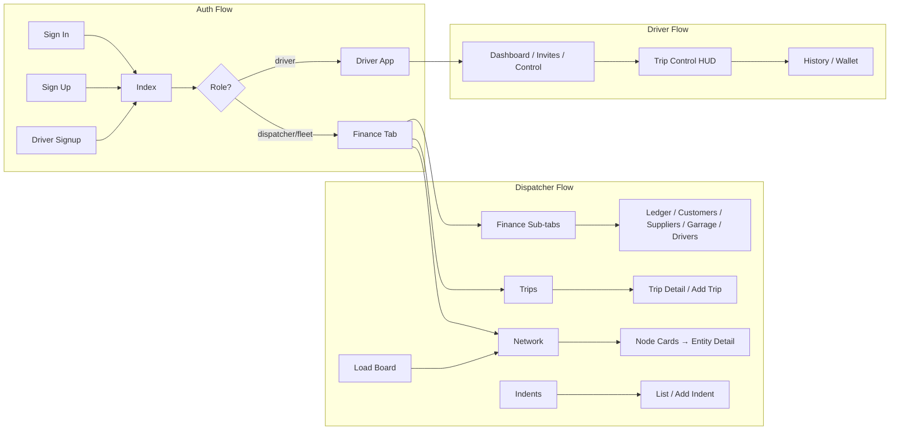

# Q Mobile — Product Requirements Document (PRD)

## 1. Scope and roles

**Product:** Q Mobile — mobile client for the Q-unified-base ecosystem (same Supabase DB; capability-based access).

**Roles:**
- **Dispatcher / Fleet user** — non-driver; uses (tabs): Finance (Fiscal), Ops Agent, Trips, plus hidden tabs (Network, Indents, Resources, Settings). Capabilities derived from profile `aggregated` / `asset` (see [lib/capabilities.ts](../lib/capabilities.ts)).
- **Driver** — `profile.role === 'driver'`; uses (driver) stack: Dashboard (Radar), Trip Control, History, Wallet, Profile, Settings.

**Entry:** [app/index.tsx](../app/index.tsx) redirects unauthenticated → sign-in; driver → `/(driver)`; non-driver → `/(tabs)/finance`.

---

## 2. High-level flows

---

## 3. Feature table — Auth and session

| US Case ID | Feature | Description | Screen / Route | Dependencies | Flow |
|------------|---------|-------------|----------------|--------------|------|
| US-001 | Sign in | Email/password sign-in; show/hide password; session-expired banner; offline banner; link to sign-up | [app/sign-in.tsx](../app/sign-in.tsx) | None | Auth |
| US-002 | Sign up (dispatcher/fleet) | Tabs: User / Driver; operating model (Asset / Aggregate / Both); full name, email, phone, password; offline check | [app/sign-up.tsx](../app/sign-up.tsx) | None | Auth |
| US-003 | Driver onboarding | Multi-step: (1) phone, (2) name/vehicle/email/password, (3) avatar picker, (4) success → driver app | [app/driver-signup.tsx](../app/driver-signup.tsx) | None | Auth |
| US-004 | Post-login redirect | Loading spinner; redirect unauthenticated → sign-in; driver → (driver); non-driver → (tabs)/finance | [app/index.tsx](../app/index.tsx) | US-001, AuthContext, profile.role | Auth |
| US-005 | Session expiry / error handling | ErrorBoundary and session-expired handling in root layout | [app/_layout.tsx](../app/_layout.tsx) | US-001 | Auth |
| US-006 | Sign out | Sign out from Settings (tabs and driver), Profile (tabs and driver), Ops header | [app/(tabs)/settings.tsx](../app/(tabs)/settings.tsx), [app/(tabs)/profile.tsx](../app/(tabs)/profile.tsx), [app/(driver)/settings.tsx](../app/(driver)/settings.tsx), [app/(driver)/profile.tsx](../app/(driver)/profile.tsx) | US-001, AuthContext | Auth |

---

## 4. Feature table — Dispatcher / Fleet (tabs)

| US Case ID | Feature | Description | Screen / Route | Dependencies | Flow |
|------------|---------|-------------|----------------|--------------|------|
| US-010 | Tab navigation | 3 visible tabs: FISCAL, Ops Agent, TRIPS; LOAD FAB; hidden: ops-agent, network, indents, resources, settings | [app/(tabs)/_layout.tsx](../app/(tabs)/_layout.tsx) | US-004 | Dispatcher |
| US-011 | Ops Agent (default tab) | Autopilot UI; network signal; chat + "EXECUTE COMMAND…"; Send; success toast; logout; links to Load Board, Network, Profile | [app/(tabs)/index.tsx](../app/(tabs)/index.tsx) | US-004 | Dispatcher |
| US-012 | Ops Agent (alternate) | Same as index: Fleet Autopilot; chat; TeslaHeader → network, profile | [app/(tabs)/ops-agent.tsx](../app/(tabs)/ops-agent.tsx) | US-010 | Dispatcher |
| US-013 | Resources / More | Links to Profile, Finance (Cashbook) | [app/(tabs)/resources.tsx](../app/(tabs)/resources.tsx) | US-010 | Dispatcher |
| US-014 | Settings (tabs) | Account & preferences; user email; Sign out | [app/(tabs)/settings.tsx](../app/(tabs)/settings.tsx) | US-006 | Dispatcher |
| US-015 | Profile (tabs) | Shortcuts (Finance, Load Board, Network); profile info (name, phone, org, capabilities); edit; capabilities list; sign out | [app/(tabs)/profile.tsx](../app/(tabs)/profile.tsx) | US-006, getCapabilitiesFromProfile | Dispatcher |

---

## 5. Feature table — Finance (Fiscal / Cashbook)

| US Case ID | Feature | Description | Screen / Route | Dependencies | Flow |
|------------|---------|-------------|----------------|--------------|------|
| US-020 | Finance access gate | canAccessFinance(capabilities); no-access message if denied | [app/(tabs)/finance.tsx](../app/(tabs)/finance.tsx) | finance_view or finance_manage | Finance |
| US-021 | Finance sub-tabs | Ledger, Customers, Suppliers, Garrage, Drivers (pill tabs) | [app/(tabs)/finance.tsx](../app/(tabs)/finance.tsx) | US-020, OrganizationContext | Finance |
| US-022 | Treasury summary | Summary banner/card per tab (Total Cash In/Out, Billing/Balance, etc.); period filter (TODAY / MONTH / RANGE) | [app/(tabs)/finance.tsx](../app/(tabs)/finance.tsx), TreasurySummaryBanner, TreasurySummaryCard | US-021, getTransactionsByOrganization, aggregation | Finance |
| US-023 | Ledger tab | List ledger entries; period filter; add transaction FAB; edit entry; realtime transactions | [app/(tabs)/finance.tsx](../app/(tabs)/finance.tsx), LedgerTab, AddTransactionModal | US-021, finance service, createLedgerEntry, updateLedgerEntry | Finance |
| US-024 | Customers tab (Finance) | Entity list with totals; open entity overlay; link to client detail | [app/(tabs)/finance.tsx](../app/(tabs)/finance.tsx), CustomersTab | US-021, getClientsByOrganization, useClientsWithTotals | Finance |
| US-025 | Suppliers tab (Finance) | Entity list with totals; open entity overlay; link to supplier detail | [app/(tabs)/finance.tsx](../app/(tabs)/finance.tsx), SuppliersTab | US-021, getSuppliersByOrganization, useSuppliersWithTotals | Finance |
| US-026 | Garrage tab (Finance) | Vehicle list with totals; open entity overlay; link to vehicle detail | [app/(tabs)/finance.tsx](../app/(tabs)/finance.tsx), GarrageTab | US-021, getVehiclesByOrganization | Finance |
| US-027 | Drivers tab (Finance) | Driver list with totals; open entity overlay; link to driver detail | [app/(tabs)/finance.tsx](../app/(tabs)/finance.tsx), DriversTab | US-021, getDriversByOrganization | Finance |
| US-028 | Entity detail overlay | Shared overlay for client/supplier/vehicle/driver: transactions, totals, link to full detail screen | [features/finance/components/EntityDetailOverlay.tsx](../features/finance/components/EntityDetailOverlay.tsx) | US-024–US-027 | Finance |
| US-029 | Add transaction modal | Party (client/supplier/driver), trip, amount in/out, date; create/update ledger entry | AddTransactionModal | US-023, getTransactionsByOrganization, createLedgerEntry, updateLedgerEntry | Finance |
| US-030 | Shared ledger modal | Shared ledger view from Finance | [features/finance/components/SharedLedgerModal.tsx](../features/finance/components/SharedLedgerModal.tsx) | US-023 | Finance |
| US-031 | Ledger report modal | Report view (date range, You Gave / You Got, entries) | [features/finance/components/LedgerReportModal.tsx](../features/finance/components/LedgerReportModal.tsx) | US-023 | Finance |
| US-032 | Finance FABs | Per-tab FAB: Ledger → add transaction; Customers → add client; Suppliers → add supplier; Garrage → add vehicle; Drivers → add driver | [app/(tabs)/finance.tsx](../app/(tabs)/finance.tsx) | US-023–US-027, modals add-client/add-supplier/add-vehicle/add-driver | Finance |

---

## 6. Feature table — Trips

| US Case ID | Feature | Description | Screen / Route | Dependencies | Flow |
|------------|---------|-------------|----------------|--------------|------|
| US-040 | Trips access gate | canAccessTrips(capabilities); no-access message if denied | [app/(tabs)/trips.tsx](../app/(tabs)/trips.tsx) | dispatch or dispatch_for_own_fleet | Trips |
| US-041 | Trips list | Active / Completed filter; Private Book vs Shared Ledger filter; trip cards; ledger received per trip; realtime trips + transactions | [app/(tabs)/trips.tsx](../app/(tabs)/trips.tsx) | US-040, getTripsByOrganization, getLatestAssignmentAuditByTripIds, useRealtimeTrips | Trips |
| US-042 | Add Trip (modal) | AddTripModal: pickup, drop, client, prices, driver/vehicle; create trip; close → (tabs)/trips | [app/(modals)/add-trip.tsx](../app/(modals)/add-trip.tsx), [features/trips/components/add-trip/AddTripModal.tsx](../features/trips/components/add-trip/AddTripModal.tsx) | US-040, createTrip, useClientsForTrip, canAssignTrip | Trips |
| US-043 | Add Trip (pushed) | Full-screen add-trip route; same AddTripModal; create then router.back() | [app/add-trip.tsx](../app/add-trip.tsx) | US-042 | Trips |
| US-044 | Trip detail | Tabs: Tracking, Finance; assignment block (private/shared); partner card; assign driver/vehicle (if canAssign); status; ledger link | [app/trip/[id].tsx](../app/trip/[id].tsx), [features/trips/components/trip-detail/TripDetailScreen.tsx](../features/trips/components/trip-detail/TripDetailScreen.tsx) | US-040, getTripById, getDriverById, getVehicleById, getSupplierById, getLatestAssignmentAuditByTripIds | Trips |
| US-045 | Trip assignment (private vs shared) | Show who assigned; filter by Private Book / Shared Ledger | [app/(tabs)/trips.tsx](../app/(tabs)/trips.tsx), TripAssignmentBlock | US-041, trip-assignment-audit.service | Trips |
| US-046 | Navigate to trip from ledger | From Finance ledger entry with trip_id → router.push(`/trip/${tripId}`) | [app/(tabs)/finance.tsx](../app/(tabs)/finance.tsx) | US-023, US-044 | Finance / Trips |

---

## 7. Feature table — Indents

| US Case ID | Feature | Description | Screen / Route | Dependencies | Flow |
|------------|---------|-------------|----------------|--------------|------|
| US-050 | Indents access gate | canAccessIndents(capabilities); no-access message if denied | [app/(tabs)/indents.tsx](../app/(tabs)/indents.tsx) | dispatch or dispatch_for_own_fleet | Indents |
| US-051 | Indents list | Search; summary (pending count, total value); indent list (display number, pickup→drop, client, price, status) | [app/(tabs)/indents.tsx](../app/(tabs)/indents.tsx) | US-050, getIndentsByOrganization, getIndentDisplayNumber | Indents |
| US-052 | Add Indent FAB | FAB present; action currently no-op (TODO) | [app/(tabs)/indents.tsx](../app/(tabs)/indents.tsx) | US-050 | Indents |

---

## 8. Feature table — Network and Load Board

| US Case ID | Feature | Description | Screen / Route | Dependencies | Flow |
|------------|---------|-------------|----------------|--------------|------|
| US-060 | Network (tab) | Node Management; filters ALL / REQUESTS / CLIENT / SUPPLIER / DRIVER; node cards from org clients, suppliers, drivers; tap → entity detail | [app/(tabs)/network.tsx](../app/(tabs)/network.tsx) | getClientsByOrganization, getSuppliersByOrganization, getDriversByOrganization | Network |
| US-061 | Network (standalone) | Same as tab; "Network Registry / Handshake Center"; TeslaHeader; filter tabs; mock node cards; Accept / Invite / Request (mock) | [app/network.tsx](../app/network.tsx) | — | Network |
| US-062 | Load Board (root/modal) | Trip Exchange; GIVE LOAD / GET LOAD; indents; CREATE INDENT; Sync Nodes → (tabs)/network | [app/load-board.tsx](../app/load-board.tsx), [app/(modals)/load-board.tsx](../app/(modals)/load-board.tsx) | US-060 | Load Board |

---

## 9. Feature table — Entity CRUD and detail screens

| US Case ID | Feature | Description | Screen / Route | Dependencies | Flow |
|------------|---------|-------------|----------------|--------------|------|
| US-070 | Add client modal | AddClientModal: contact person, phone, organization name; create client; close → (tabs)/finance | [app/(modals)/add-client.tsx](../app/(modals)/add-client.tsx) | canAccessClients, createClient | Entity |
| US-071 | Add supplier modal | AddSupplierModal: company name, contact, phone, email, areas, vehicle types, supplier type; create supplier | [app/(modals)/add-supplier.tsx](../app/(modals)/add-supplier.tsx) | createSupplier | Entity |
| US-072 | Add driver modal | AddDriverModal: invite (in-app or create row); Send Invitation vs Add Driver; close → (tabs)/finance | [app/(modals)/add-driver.tsx](../app/(modals)/add-driver.tsx) | inviteDriver / createDriver | Entity |
| US-073 | Add vehicle modal | AddVehicleModal: source, number, type, capacity, brand/model/body/size/axle, documents; close → (tabs)/finance (Garrage) | [app/(modals)/add-vehicle.tsx](../app/(modals)/add-vehicle.tsx) | createVehicle | Entity |
| US-074 | Client detail | Client info; trips for client; transactions; add transaction modal | [app/client/[id].tsx](../app/client/[id].tsx), [features/clients/components/ClientDetailScreen.tsx](../features/clients/components/ClientDetailScreen.tsx) | getClientById, getTripsByOrganization, getTransactionsByOrganization, createLedgerEntry | Entity |
| US-075 | Driver detail (dispatcher) | Driver info; trips; assignments; link to user | [app/driver/[id].tsx](../app/driver/[id].tsx), [features/drivers/components/DriverDetailScreen.tsx](../features/drivers/components/DriverDetailScreen.tsx) | getDriverById, getTripsByDriver | Entity |
| US-076 | Supplier detail | Supplier info; trips; ledger context | [app/supplier/[id].tsx](../app/supplier/[id].tsx), [features/suppliers/components/SupplierDetailScreen.tsx](../features/suppliers/components/SupplierDetailScreen.tsx) | getSupplierById | Entity |
| US-077 | Vehicle detail | Vehicle info; trips; documents | [app/vehicle/[id].tsx](../app/vehicle/[id].tsx), [features/vehicles/components/VehicleDetailScreen.tsx](../features/vehicles/components/VehicleDetailScreen.tsx) | getVehicleById | Entity |

---

## 10. Feature table — Customers (standalone tab)

| US Case ID | Feature | Description | Screen / Route | Dependencies | Flow |
|------------|---------|-------------|----------------|--------------|------|
| US-080 | Customers list (tab) | ListScreenLayout "Customers"; search; summary card; client list; Add Customer FAB; capability gate | [app/(tabs)/clients.tsx](../app/(tabs)/clients.tsx) | canAccessClients, getClientsByOrganization | Dispatcher |
| US-081 | Navigate to payment detail | From clients list → (tabs)/payment-detail (sample data) | [app/(tabs)/clients.tsx](../app/(tabs)/clients.tsx) | — | Dispatcher |

---

## 11. Feature table — Report and Payment detail (placeholder)

| US Case ID | Feature | Description | Screen / Route | Dependencies | Flow |
|------------|---------|-------------|----------------|--------------|------|
| US-090 | View Report | Date range; search/filter; You Gave / You Got / net balance; transaction list; download/share TODO | [app/(tabs)/report.tsx](../app/(tabs)/report.tsx) | Sample data | Finance |
| US-091 | Payment detail | Contact name; You'll Give / You'll get; transaction list; Add contact, Settings, Call, Menu, Report, Reminders, SMS (sample data) | [app/(tabs)/payment-detail.tsx](../app/(tabs)/payment-detail.tsx) | — | Dispatcher |

---

## 12. Feature table — Driver app

| US Case ID | Feature | Description | Screen / Route | Dependencies | Flow |
|------------|---------|-------------|----------------|--------------|------|
| US-100 | Driver dashboard (Radar) | Sub-tabs: Scanning / Schedule; assigned/active missions; driver invites (accept/decline); rank popup; trip cards; avatar/level | [app/(driver)/index.tsx](../app/(driver)/index.tsx) | getLinkedDriversForCurrentUser, getDriverInvitesReceived, getTripsByDriverIds | Driver |
| US-101 | Accept / reject driver invite | From dashboard; acceptDriverInvite / rejectDriverInvite | [app/(driver)/index.tsx](../app/(driver)/index.tsx) | US-100, driversService | Driver |
| US-102 | Trip control (HUD) | Active trip by tripId; steps Start → Pickup → Transit → Complete; hold-to-advance; trip details; driver avatar | [app/(driver)/control.tsx](../app/(driver)/control.tsx) | getTripById, updateTripStatus, getLinkedDriversForCurrentUser | Driver |
| US-103 | Driver trip history | List of driver's trips; tap for detail modal; completed count | [app/(driver)/trips.tsx](../app/(driver)/trips.tsx) | getTripsByDriverIds | Driver |
| US-104 | Driver wallet | Stats (mock); ledger/transaction list; driver avatar | [app/(driver)/wallet.tsx](../app/(driver)/wallet.tsx) | — | Driver |
| US-105 | Driver profile (Pilot) | Avatar picker; name/phone/vehicle edit; Pilot Matrix; rank path; theme; sign out | [app/(driver)/profile.tsx](../app/(driver)/profile.tsx) | US-006, DriverAvatarContext, DriverThemeContext | Driver |
| US-106 | Driver settings | Theme (light/dark); Sign out | [app/(driver)/settings.tsx](../app/(driver)/settings.tsx) | US-006 | Driver |

---

## 13. Feature table — Shared / layout

| US Case ID | Feature | Description | Screen / Route | Dependencies | Flow |
|------------|---------|-------------|----------------|--------------|------|
| US-110 | Safe area and layout | All screens respect safe area (insets); ListScreenLayout, DetailPageLayout, TeslaHeader, CenteredLoadingView | app/*, [components/](../components/) | — | Global |
| US-111 | Theme and constants | Colors from Theme; Layout constants; no hardcoded hex | [constants/Theme.ts](../constants/Theme.ts), [constants/Layout.ts](../constants/Layout.ts) | — | Global |
| US-112 | Organization context | Current org for list/detail; refreshOrganization | [contexts/OrganizationContext.tsx](../contexts/OrganizationContext.tsx) | AuthContext, getOrganizationsForUser | Global |
| US-113 | 404 | "This screen doesn't exist"; link to home | [app/+not-found.tsx](../app/+not-found.tsx) | — | Global |
| US-114 | Network status | Offline/network handling (e.g. network.tsx, banners) | [app/network.tsx](../app/network.tsx), sign-in banner | — | Global |

---

## 14. Dependency summary (by flow)

- **Auth:** US-001 → US-004, US-006; US-002, US-003 feed into US-004.
- **Finance:** US-020 → US-021 → US-022–US-032; US-023 depends on finance service; US-024–US-027 depend on clients/suppliers/vehicles/drivers services; US-032 depends on US-070–US-073 (modals).
- **Trips:** US-040 → US-041, US-042, US-044; US-042 depends on clients (useClientsForTrip) and createTrip; US-044 depends on trip/driver/vehicle/supplier fetch and assignment audit.
- **Indents:** US-050 → US-051, US-052; US-052 (Add Indent) has no implementation yet.
- **Network:** US-060 depends on clients, suppliers, drivers services; US-062 links to US-060.
- **Entity:** US-070–US-073 depend on respective create* services; US-074–US-077 depend on get*ById and related data.
- **Driver:** US-100 depends on driver link and invites; US-102 depends on trip status updates.

---

## 15. Capability → feature mapping

| Capability | Enables features (US) |
|------------|------------------------|
| finance_view / finance_manage | US-020–US-032 |
| dispatch / dispatch_for_own_fleet | US-040–US-046, US-050–US-052 |
| fleet_management | US-026, US-027, US-073, US-077, US-072, US-075 |
| clients (effective) | US-024, US-070, US-074, US-080 |
| suppliers (effective) | US-025, US-071, US-076 |
| team_manage | (invite/manage team — referenced in capabilities; not yet a dedicated screen set in this PRD) |

---

## 16. Deliverables

- **Single PRD document:** This document (`docs/PRD.md`) with the tables and flow diagram above.
- Implementation can reference US IDs in tickets and QA.

Optional next steps: add **acceptance criteria per US** or **test scenarios per flow** in a separate section of this doc.
