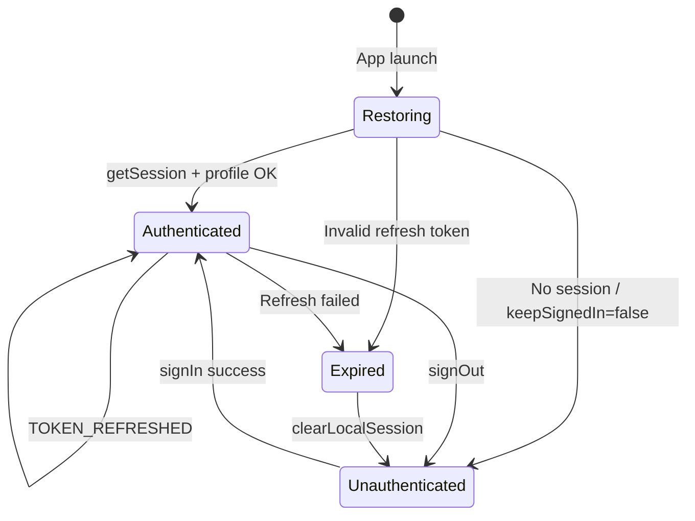

# Application User Flow Document

**Product:** Pulse — Transport & Logistics Operations Platform  
**Document version:** 1.1 (Part 1 + Part 2)  
**Last updated:** 2026-07-13  
**Status:** Part 1 approved · Part 2 draft for review

---

## Document control

| Part | Scope | Status |
|------|--------|--------|
| **Part 1** | Overview, onboarding decision tree, visitor registration, business user signup, driver signup, team-invite join during signup | **Approved** |
| **Part 2** | Login/auth, extended organization, profile completion | **This draft — for review** |
| Part 3 | Client & supplier flows, team management, driver management | Planned |
| Part 4 | Form catalog, permissions matrix, notifications, QA master list | Planned |

**Platforms covered:** React Native (Expo) mobile app + responsive web (Expo web).  
**Auth backend:** Supabase Auth (email/password, Google OAuth).  
**Primary routes:** `/sign-in`, `/sign-up`, `/driver-signup`, `/forgot-password`, `/auth/reset-password`, `/auth/callback`.

### Implementation status legend

Every flow subsection is tagged with one of:

| Label | Meaning |
|-------|---------|
| **Current** | Shipped behavior — test against this |
| **Partially implemented** | Core path works; noted gaps (mock OTP, optional steps, etc.) |
| **Planned** | Product intent documented; not in production UI/API yet |

### Field table convention

All form field tables include a **Source of truth** column mapping UI → persistence:

| Source value | Meaning |
|--------------|---------|
| UI field | React state / form control only until submit |
| `auth.users` metadata | `raw_user_meta_data` via signUp / updateUser |
| `profiles.*` | `public.profiles` column |
| `organizations.*` | `public.organizations` column |
| RPC payload | Argument to named Supabase RPC |
| Storage path | Supabase Storage object key |
| Derived / system | Trigger, computed route, or read-only display |

---

## 1. Overview

### 1.1 Purpose

Pulse is a SaaS transport-management and fleet-operations platform. Operators (dispatchers, fleet owners, brokers) manage trips, clients, suppliers, drivers, and finance from a unified workspace. Drivers use a dedicated mobile experience for trip execution, documents, and payouts.

This document specifies **end-to-end user flows** so engineering, design, QA, and product can implement, test, and ship consistently.

### 1.2 Primary user roles (signup-relevant)

| Role | `profiles.role` | Signup entry | Post-signup destination |
|------|-----------------|--------------|-------------------------|
| **Business user (operator)** | `user` | `/sign-up` | `/(tabs)/finance` or workspace home (capability-gated) |
| **Driver** | `driver` | `/driver-signup` | `/(driver)` stack |
| **Team member (join existing org)** | `user` | `/sign-up?intent=team` or invite deep link | Same org as inviter; trips/finance per capabilities |

There is no separate “customer” or “supplier” auth role at signup — those are **master-data entities** created inside an organization after the operator account exists.

### 1.3 Main modules touched during signup

| Module | Responsibility during signup |
|--------|------------------------------|
| Auth (`features/auth`) | Sign-up, sign-in, session, OAuth, duplicate checks |
| Onboarding (`lib/onboarding`) | Onboarding type (`owner` / `member`), branding steps, analytics |
| Platform identity | Phone OTP verification, invitation resolution |
| Organization (DB trigger) | Org + `organization_members` row for `owner`; join for `member` |
| Drivers (DB trigger + storage) | `drivers` row on driver signup; document upload to `driver-documents` bucket |
| Profiles | `public.profiles` synced from auth metadata via `handle_new_user` trigger |

### 1.4 Assumptions

1. **India-first phone validation** — 10-digit mobile or `+91` prefix; canonical storage as E.164 `+91XXXXXXXXXX`.
2. **Phone OTP (business signup)** — UI accepts 6 digits; current implementation uses **mock OTP** (any valid-length code proceeds). Production SMS integration is a backend swap, not a flow change.
3. **Driver OTP** — UI accepts **4 digits**; same mock behavior.
4. **Email verification** — When enabled in Supabase, `email_confirmed_at` is null until the user clicks the link; sign-in may be blocked until confirmed.
5. **Org creation** — Only `onboarding_type: owner` provisions a new `organizations` row. `member` joins via invitation RPC after auth.
6. **No OTP-only passwordless login** at signup — password (or Google OAuth) is required to create the auth record.
7. **Terms & privacy** — Implicit acceptance on account creation (link shown in UI); explicit checkbox is a future enhancement if legal requires it.

---

## 2. User Roles and Access Levels (signup context)

Detailed permissions matrix is in Part 4. For signup, only these distinctions matter:

| Actor | Can self-register? | Creates org? | Approval required? |
|-------|-------------------|--------------|-------------------|
| Business owner | Yes (`/sign-up`, owner track) | Yes | No (instant workspace) |
| Team member | Yes (`/sign-up`, invite track) | No | Invite must be `active` |
| Driver | Yes (`/driver-signup`) | No | Documents skippable at signup; fleet assignment separate |
| Super Admin | No public signup | — | Provisioned internally |

**Capabilities** (`fleet_management`, `dispatch`, `finance_view`, etc.) are **not** chosen at signup. Owner receives default owner/admin membership; invited members receive the role on the invitation.

---

## 3. Global Onboarding Flow

### 3.1 Decision tree

```mermaid
flowchart TD
  A[Visitor lands on app] --> B{Authenticated?}
  B -->|Yes| Z[app/index.tsx routes by role]
  B -->|No| C[Sign In / Sign Up choice]

  C --> D{Sign up type}
  D -->|Business operator| E["/sign-up"]
  D -->|Driver| F["/driver-signup"]

  E --> G[Phone + OTP]
  G --> H{Invitations for phone?}
  H -->|None / owner intent| I[Owner track: Org → Company → Location → Account]
  H -->|Active invite(s)| J[Invite track: Accept / Picker / Existing account]
  I --> K[Create auth + org via signUp onboardingType owner]
  J --> L[Create auth onboardingType member + completeInvitationJoin]
  K --> M[Post-auth branding: Logo → Photo → Success]
  L --> N[Redirect to trips tab]
  M --> O[Enter workspace]

  F --> P[Phone + OTP 4-digit]
  P --> Q[Account credentials]
  Q --> R[Optional docs: License → Aadhaar → PAN]
  R --> S[Profile photo / preset avatar]
  S --> T[signUp role driver + auto sign-in]
  T --> U[Driver app /(driver)]
```

### 3.2 Entry points

| Entry | URL / route | Behavior |
|-------|-------------|----------|
| Default sign-up | `/sign-up` | Business owner onboarding (8-step wizard) |
| Team invite | `/sign-up?intent=team` or `?invite=<token>` | Skips intro; resolves invites after OTP |
| Driver sign-up | `/driver-signup` | 8-step driver wizard |
| Sign-in cross-link | From any signup step footer | `/sign-in` with optional `?email=` prefilled |
| Google OAuth (business) | Account step or welcome | Pending metadata applied after OAuth callback |
| Google OAuth (driver) | Phone step shortcut | `role: driver` in pending metadata → driver home |

### 3.3 Verification and approval paths

| Path | Verification | Approval |
|------|--------------|----------|
| Owner signup | Phone OTP (mock) + optional email link | None — workspace active immediately |
| Member signup | Phone OTP + invite token validity | Invite accepted via `completeInvitationJoin` RPC |
| Driver signup | Phone OTP (mock) + optional email link | No admin gate at signup; documents optional/skippable |
| Duplicate phone | Redirect to sign-in with masked email | N/A |
| Duplicate org name | Blocked at org step | User must request admin invite |
| Expired invite | UI: request new invitation | Cannot join until re-invited |

---

## 4. Detailed User Flows — Signup

---

### 4.1 Visitor Registration Flow

> **Implementation status:** **Partially implemented** — full wizard is **Current**; phone OTP is mock (**Planned:** production SMS); explicit terms checkbox is **Planned**.

#### 4.1.1 Objective

Convert an unauthenticated visitor into a registered user (business operator or driver) with a verified phone identity and secured credentials.

#### 4.1.2 Actors

- **Primary:** Visitor (prospective user or driver)
- **System:** Supabase Auth, Platform Identity service, DB triggers (`handle_new_user`)

#### 4.1.3 Preconditions

- App installed or web app loaded
- Network connectivity (offline blocks progression with alert)
- For team join: valid pending invitation matching verified phone (or email on invite path)

#### 4.1.4 Trigger points

| Surface | Action |
|---------|--------|
| Sign-in screen | “Create account” / suite-specific sign-up link → `/sign-up` or `/driver-signup` |
| Marketing / deep link | Direct navigation to signup routes |
| Duplicate phone detection | Inline banner → “Sign in instead” with email prefilled |

#### 4.1.5 Step-by-step flow (business — high level)

| Step | Label | Screen purpose |
|------|-------|----------------|
| 0 | Phone | Capture Indian mobile; debounced duplicate check |
| 1 | Verify | Enter 6-digit OTP; resolve invitations |
| 2 | Org | Workspace name (owner) OR invite acceptance UI (member) |
| 3 | Profile | Business type, operating model, scale bands |
| 4 | City | Office address, map pin, city/state/pincode |
| 5 | Account | Full name, email, password; Google OAuth alternative |
| 6 | Logo | Upload org logo (post-auth, skippable) |
| 7 | Photo | Profile avatar upload or preset (post-auth, skippable) |
| 8 | Done | Success + email verification reminder if applicable |

#### 4.1.6 Account type selection

Pulse uses **separate routes** rather than a single “pick role” screen:

| Choice | Route | `profiles.role` |
|--------|-------|-----------------|
| I run a transport business | `/sign-up` | `user` |
| I am a driver | `/driver-signup` | `driver` |

Cross-links on each flow footer allow switching intent.

#### 4.1.7 Terms and privacy

- Privacy policy and terms links are displayed on credential steps (implementation in signup shell).
- **Current behavior:** Proceeding with “Create account” constitutes acceptance.
- **Recommended (Part 2 UX):** Explicit required checkbox with link opens in-app browser.

#### 4.1.8 Success state

- Auth user created in `auth.users`
- `public.profiles` row exists (trigger)
- Owner: `organizations` + `organization_members` (role `owner`, status `active`)
- Driver: `drivers` row linked when applicable
- Session established (or email verification pending with branding steps queued)

#### 4.1.9 Failure / error cases

| Error | User message | Recovery |
|-------|--------------|----------|
| Offline | “Connect to continue.” | Retry when online |
| Phone invalid | Inline / alert with validation message | Correct phone |
| Phone already registered | Masked email shown; redirect sign-in | Sign in |
| OTP too short | “Enter the 6-digit OTP.” | Re-enter |
| Org name taken | Workspace-specific message + admin invite guidance | New name or get invite |
| Sign-up API failure | Error alert with safe message | Retry |
| Email not confirmed | “Confirm your email before signing in.” | Resend verification (60s cooldown) |

#### 4.1.10 Edge cases

- User closes app mid-flow → business signup persists branding step in AsyncStorage (`@pulse_business_signup_branding_*`); driver success flag resumes at Done step.
- Phone lookup timeout (3.5s) → fails open (treat as not existing) to avoid blocking signup.
- OAuth partial metadata failure → user signed in; alert to complete business profile in workspace.
- Web Android back gesture → history stack per step (steps 1–5); post-auth steps block back to submitted forms.

#### 4.1.11 Notifications triggered

| Event | Channel | Recipient |
|-------|---------|-----------|
| Sign-up (email confirmation on) | Email | New user |
| OTP (production) | SMS | Phone on step 0 |
| Invite accepted | In-app + optional email | Inviter admin |

#### 4.1.12 Role permissions

Signup flows are **anonymous** until account creation. Post-creation, RLS applies per new profile.

#### 4.1.13 Audit log events

| Event | Payload (recommended) |
|-------|----------------------|
| `onboarding.owner_signup_started` | `entry_source`, `device` |
| `onboarding.otp_verified` | `onboarding_type`, `invite_count` |
| `onboarding.invitation_accepted` | `invite_id`, `org_id` |
| `auth.user_created` | `user_id`, `role`, `onboarding_type` |

(Analytics today: `trackOnboardingEvent` in `lib/onboarding/onboardingAnalytics.ts`.)

#### 4.1.14 QA test scenarios

| ID | Type | Scenario | Expected |
|----|------|----------|----------|
| VR-01 | Happy path | New phone, owner path, all steps | Org created; lands in workspace |
| VR-02 | Negative | Existing phone on step 0 | Redirect sign-in; email prefilled |
| VR-03 | Negative | Offline on continue | Blocked with alert |
| VR-04 | Negative | Invalid OTP length (5 digits) | Cannot proceed; no step advance |
| VR-05 | Happy path | Google OAuth owner path | Session + org metadata applied |
| VR-06 | Resume / interrupted | App kill at step 6 (logo) | Resume logo step on relaunch via branding flag |
| VR-07 | Resume / interrupted | Kill app during OTP step 1 | Restart signup; phone re-entry or pending invite restore |
| VR-08 | Negative | Org name taken mid-flow after debounce showed free | Block at submit with conflict message |

---

### 4.2 Sign Up as User (Business Operator)

> **Implementation status:** **Current** (owner + member invite tracks). Phone OTP verification: **Partially implemented** (mock). Subscription plan selection: **Planned**.

**Route:** `/sign-up`  
**Implementation:** `features/auth/signup/BusinessSignUpScreen.tsx` + `useBusinessSignUpFlow.ts`  
**Onboarding type:** `owner` (default) or `member` (invite track)

#### 4.2.1 Objective

Register a transport operator, provision a new workspace (owner) or join an existing one (member), and complete minimal branding before entering the app.

#### 4.2.2 Actors

- Business owner (creates org)
- Invited team member
- Organization admin (passive — receives join notification)

#### 4.2.3 Preconditions

- Valid Indian mobile not already tied to another account (or user intends to sign in on invite-existing path)
- For owner: org name not already taken (case-insensitive)
- For member: active invitation matching verified phone

#### 4.2.4 Trigger point

User selects business sign-up from sign-in or lands on `/sign-up`.

---

#### 4.2.5 Step-by-step flow — Owner track

**Step 0 — Phone (Identity)**

1. User enters mobile number (auto-formatted).
2. System debounces (280ms) `checkExistingUserByPhone` RPC.
3. If exists → show masked email hint; continue still allowed to OTP (invite resolution may differ).
4. User taps Continue → OTP countdown starts (30s resend).

**Step 1 — OTP (Verification)**

1. User enters 6-digit code (mock: any 6 digits accepted).
2. System calls `platformIdentityService.resolveInvitations` + `resolveOnboardingContext`.
3. If context type = `owner` → Step 2 owner org form.
4. If invites found → branch to **§4.2.6 Member track**.

**Step 2 — Workspace (Org name)**

1. User enters **workspace display name** (maps to `organizations.name` / `company_name` metadata).
2. Debounced (600ms) `organization_name_is_taken` RPC.
3. If taken → inline error: ask admin for invite.
4. Continue → Step 3.

**Step 3 — Operations profile**

1. User selects business structure, employee band, operating model.
2. Conditional bands:
   - **Asset / Hybrid** → fleet size band required
   - **Aggregate / Hybrid** → monthly shipment volume band required
3. Continue → Step 4.

**Step 4 — Base location**

1. User enters street address (required), locality (optional).
2. User searches map / place → lat/lon, auto pincode resolution, city/state picker (`IndiaLocation`).
3. PIN code validated (6 digits, first digit 1–9).
4. Continue → Step 5.

**Step 5 — Credentials**

1. User enters full name, email, password, confirm password.
2. Optional: **Continue with Google** (stores pending metadata → OAuth → `applyPendingOAuthMetadata`).
3. Final org-name guard before submit.
4. `signUp({ role: 'user', onboardingType: 'owner', ... })`.
5. If `emailVerificationRequired` → flag for success screen.
6. Auto-enter Step 6 (post-auth branding).

**Step 6 — Logo (optional)**

1. Pick/upload org logo → `pickAndUploadOrgLogo` → `updateOrganizationLogo`.
2. Skip or Continue.

**Step 7 — Photo (optional)**

1. Upload photo or select preset avatar seed.
2. `updateProfile({ avatar_url | avatar_seed })`.
3. If no session yet (email unverified) → queue in `pendingPersonalization`.

**Step 8 — Success**

1. Clear branding flags.
2. Navigate to app index → finance/trips per capabilities.

---

#### 4.2.6 Step-by-step flow — Member track (team invite)

Triggered when OTP resolution finds active invitation(s) for the verified phone.

| Invite phase | UI | Next action |
|--------------|-----|-------------|
| `picker` | Multiple invites listed | User selects one → `continueInvitePicker` |
| `accept` | Single invite summary | User enters credentials → `acceptTeamInvitation` |
| `existing_account` | Email already registered | Sign in → `signInToAcceptInvitation` |
| `expired` | Expired list | Request new invite or start owner path |
| `no_invite` | No matching invite | `startOwnerOnboarding` fallback |

**Member account creation**

```
signUp({
  role: 'user',
  onboardingType: 'member',
  phone, email, password, fullName,
  operatingModel: 'HYBRID',
})
→ ensureAuthSession()
→ completeInvitationJoin(inviteId)
→ router.replace(ROUTES.TABS.TRIPS)
```

**Validations specific to invite path**

- Email must not already exist on **new account** path → switch to existing-account phase.
- Phone on account must match invitee phone or admin must re-invite by email.
- Invite email registered check via `check_email_registered_for_signup` RPC.

---

#### 4.2.7 Field-level form details — Owner track

| Step | Field name | Label | Type | Required | Example | Validation | Source of truth |
|------|------------|-------|------|----------|---------|------------|-----------------|
| 0 | `phone` | Mobile number | Phone input | **Yes** | `98765 43210` | 10-digit Indian; reject placeholders | UI → `auth.users` metadata `phone` → `profiles.phone` |
| 1 | `otp` | Verification code | 6-box OTP | **Yes** | `123456` | Length = 6 | UI only (mock); **Planned:** identity verification service |
| 2 | `orgName` | Workspace name | Text | **Yes** | `Acme Logistics` | Non-empty; max 200; unique (case-insensitive) | UI → metadata `company_name` → `organizations.name` |
| 3 | `businessType` | Business structure | Pill select | **Yes** | `PVT_LTD` | Enum list in `signUpConstants.ts` | metadata `business_type` → `organizations.business_type` |
| 3 | `operatingModel` | Fleet model | Pill select | **Yes** | `HYBRID` | ASSET_BASED, NON_ASSET, HYBRID | metadata `operating_model` → `organizations.operating_model` + `profiles.aggregated`/`asset` |
| 3 | `fleetSize` | Fleet size | Pill select | **Conditional** | `6-15` | Required if Asset or Hybrid | metadata `fleet_size_band` (auth only; org column **Planned**) |
| 3 | `monthlyVolume` | Monthly shipments | Pill select | **Conditional** | `200-500` | Required if Aggregate or Hybrid | metadata `monthly_volume_band` (auth only) |
| 3 | `employeeCount` | Employees | Pill select | **Yes** | `11-50` | Band enum | metadata `employee_count` → `organizations.employee_count` |
| 4 | `streetAddress` | Street / building | Text | **Yes** | `42 Industrial Estate` | 5–200 chars | metadata `address_line` → `organizations.address_line` |
| 4 | `locality` | Locality / area | Text | Optional | `Peenya` | Max 100 chars | metadata `locality` → `organizations.locality` |
| 4 | `officePlace` | Search on map | Place search | Optional | HQ pin | Sets lat/lon; resolves pincode | metadata `office_latitude`/`office_longitude` |
| 4 | `pincode` | PIN code | Numeric | **Yes** | `560058` | 6-digit Indian PIN | metadata `pincode` → `organizations.pincode` |
| 4 | `selectedLocation` | City & state | City picker | **Yes** | Bengaluru, KA | India location list | metadata `city`/`state`/`zone` → `organizations.*` |
| 5 | `fullName` | Full name | Text | **Yes** | `Rajesh Kumar` | 2–100 chars | metadata `full_name` → `profiles.full_name` |
| 5 | `email` | Email | Email | **Yes** | `raj@acme.in` | Format + max 255 | `auth.users.email` (GoTrue) |
| 5 | `password` | Password | Password | **Yes** | `••••••••` | 6–128 chars | `auth.users` (hashed by GoTrue) |
| 5 | `confirmPassword` | Confirm password | Password | **Yes** | `••••••••` | Must match password | UI only |
| 6 | `orgLogo` | Company logo | Image picker | Optional | — | Image upload | Storage path → `organizations.logo_url` |
| 7 | `profilePhoto` | Your photo | Image / preset | Optional | — | Avatar seed or URL | `profiles.avatar_url` or `profiles.avatar_seed` |

**Fields not collected at signup (future / settings)**

| Field | Notes |
|-------|-------|
| First / last name split | Single `fullName` only |
| Country | Implicit India for phone/address |
| Referral code | Not implemented |
| Preferred language / timezone | Device default; org timezone in settings |
| GST / PAN / legal entity | Extended org onboarding (Part 2) |
| Subscription plan | Not gated at signup |

---

#### 4.2.8 Validation rules summary

| Rule | Message |
|------|---------|
| Phone empty | From `validatePhone` |
| Phone placeholder (e.g. 1234567890) | “Enter a valid phone number.” |
| Org name empty | Cannot continue step 2 |
| Org name taken | “The workspace 'X' is already registered…” |
| Password < 6 chars | “Password must be at least 6 characters.” |
| Password mismatch | “Passwords do not match.” |
| Email format | “Enter a valid email address…” |
| PIN invalid | “Enter a valid 6-digit PIN code.” |
| Street too short | “Street address is required.” (min 5 chars) |

**Duplicate account handling**

| Check | When | Action |
|-------|------|--------|
| Phone exists | Step 0 debounce | Show masked email; suggest sign-in |
| Email registered | Invite accept | Block; offer sign-in path |
| Org name taken | Step 2 + pre-submit | Block progression |
| Company name at API | `signUp` service | “Company name already exists.” |

---

#### 4.2.9 System behavior / backend actions (owner)

| Order | Action |
|-------|--------|
| 1 | `supabase.auth.signUp` with `user_metadata`: role, operating_model, onboarding_type, address fields, bands |
| 2 | DB trigger `handle_new_user` on `auth.users` INSERT |
| 3 | Create `profiles` row |
| 4 | Create `organizations` row (owner) |
| 5 | Create `organization_members` (role owner/admin, status active) |
| 6 | Set `profiles.aggregated` / `profiles.asset` from operating model |
| 7 | Auto-assign random `avatar_seed` for business users if none chosen |
| 8 | Optional: send Supabase confirmation email |
| 9 | Post-auth: update org logo URL, profile avatar |

---

#### 4.2.10 Success state

- User authenticated (or verification pending with queued personalization)
- Organization visible in `getOrganizationsForUser()`
- User lands on dispatcher experience after index routing
- `emailVerificationRequired` shows resend on success step (60s cooldown)

#### 4.2.11 Failure cases

| Case | Behavior |
|------|----------|
| `organization_name_is_taken` RPC missing | Sign-up blocked — migration required |
| Network error | “Cannot reach server…” |
| OAuth metadata partial failure | Signed in; warning to complete profile |
| Org conflict at submit | “This workspace name is no longer available…” |
| Join invite failed | Alert with RPC error (phone mismatch, expired, etc.) |

#### 4.2.12 Notifications

| Trigger | Channel | Purpose |
|---------|---------|---------|
| Sign-up + email confirmation | Email | Verify email link |
| Invitation accepted | In-app / email | Notify inviter |
| Resend verification | Email | Re-send confirm link |

#### 4.2.13 Role permissions

- New owner: full org admin until capabilities refined
- New member: capabilities from `organization_members.role` + invitation payload

#### 4.2.14 QA test scenarios — Business signup

| ID | Type | Scenario | Expected |
|----|------|----------|----------|
| BU-01 | Happy path | Owner happy path all steps | Org + profile + session |
| BU-02 | Negative | Duplicate org name at step 2 | Blocked; inline error |
| BU-03 | Negative | Hybrid without fleet size | Validation error step 3 |
| BU-04 | Happy path | Skip logo and photo | Workspace still accessible |
| BU-05 | Negative | Email verification on; sign-in before confirm | Blocked or branding queued |
| BU-06 | Happy path | Team invite single active | Member org join; trips tab |
| BU-07 | Negative | Team invite + email already registered | `existing_account` phase |
| BU-08 | Negative | Expired invite after OTP | `expired` phase; cannot join |
| BU-09 | Happy path | Google OAuth full owner data | Same end state as password path |
| BU-10 | Resume / interrupted | Kill app after account create, before logo | Resume step 6 via branding flag |
| BU-11 | Resume / interrupted | Pending invite in AsyncStorage on cold start | Skip to invite step 2 |
| BU-12 | Negative | Phone mismatch on invite accept | Alert; admin must re-invite |

---

### 4.3 Sign Up as Driver

> **Implementation status:** **Current** (wizard + optional docs). Phone OTP: **Partially implemented** (mock, 4-digit). Admin approval gate at signup: **Planned**. License number / expiry fields: **Planned** (upload only today).

**Route:** `/driver-signup` (alias redirect: `/onboarding/driver`)  
**Implementation:** `app/driver-signup.tsx`  
**Role:** `driver` · **Operating model:** `ASSET_BASED` (metadata)

#### 4.3.1 Objective

Register an independent driver account, optionally upload KYC documents, set profile visual identity, and enter the driver app. Link to fleet roster rows happens post-signup via phone/email match (`sync_my_driver_rows_user_id`, signup-match invites).

#### 4.3.2 Actors

- Driver (self-registration)
- Fleet owner (passive — may see signup-match notification if phone matched manual driver row)

#### 4.3.3 Preconditions

- Phone not already registered (hard block with redirect to sign-in)
- Network for account creation and uploads

#### 4.3.4 Trigger point

“Sign up as driver” from sign-in or direct `/driver-signup`.

#### 4.3.5 Step-by-step flow

| Step | Label | Action |
|------|-------|--------|
| 0 | Phone | 10-digit Indian mobile; duplicate check |
| 1 | Verify | 4-digit OTP (mock) |
| 2 | Account | Full name, email, password, confirm |
| 3 | License | Upload/capture DL or skip |
| 4 | Aadhaar | Upload/capture or skip |
| 5 | PAN | Upload/capture or skip |
| 6 | Photo | Camera/gallery or preset avatar |
| 7 | Done | `establishLink` → signUp + signIn → driver home |

**Alternate:** Google sign-in on phone step → `setPendingOAuthMetadata({ role: 'driver' })` → OAuth → index routes to driver stack (skips document wizard).

#### 4.3.6 Field-level form details

| Step | Field name | Label | Type | Required | Example | Validation | Source of truth |
|------|------------|-------|------|----------|---------|------------|-----------------|
| 0 | `phone` | Mobile number | Phone | **Yes** | `98765 43210` | 10-digit Indian | metadata `phone` → `profiles.phone` |
| 1 | `otp` | Verification code | 4-box OTP | **Yes** | `1234` | Length = 4 | UI only (mock) |
| 2 | `callsign` | Full name | Text | **Yes** | `Vikram Singh` | 2–100 chars | metadata `full_name` → `profiles.full_name` |
| 2 | `email` | Email | Email | **Yes** | `vikram@mail.com` | Format + max 255 | `auth.users.email` |
| 2 | `password` | Password | Password | **Yes** | — | 6–128 chars | `auth.users` (hashed) |
| 2 | `confirmPassword` | Confirm | Password | **Yes** | — | Must match | UI only |
| 3 | `licenseDoc` | Driving license | Image/PDF | Optional* | — | JPEG/PNG/PDF | Storage `driver-documents/{uid}/license-*` |
| 4 | `aadhaarDoc` | Aadhaar | Image/PDF | Optional* | — | Same | Storage `driver-documents/{uid}/aadhaar-*` |
| 5 | `panDoc` | PAN card | Image/PDF | Optional* | — | Same | Storage `driver-documents/{uid}/pan-*` |
| 6 | `profilePhoto` | Profile photo | Image/preset | Optional | — | Upload or seed | `profiles.avatar_url` / `profiles.avatar_seed` |

\*Documents can be **skipped** per step; user can complete later from profile. UI tracks `licenseSkipped`, `aadhaarSkipped`, `panSkipped`.

**Fields in enterprise spec but NOT in current driver signup UI**

| Field | Status |
|-------|--------|
| Date of birth, gender | Post-signup profile |
| Emergency contact | Post-signup / fleet onboarding |
| License number, expiry, issue state | OCR / manual entry — future |
| Bank / UPI payout details | Wallet module post-signup |
| Vehicle type preference | Fleet assignment flow |
| Background verification consent | Future compliance module |

#### 4.3.7 Document upload flow

1. User picks gallery or camera → permission prompt if denied.
2. Asset stored in local `pendingDocs` state (base64 on native).
3. If already authenticated mid-flow → immediate upload to `driver-documents` bucket path `{uid}/{docType}-{timestamp}.{ext}`.
4. On **Create account** (`establishLink`): `uploadDriverDocuments` uploads any pending files; `syncDriverDocumentMetadata` writes DB references.
5. Partial failure → account created; alert to re-upload from profile documents.

**Supported MIME types:** `image/jpeg`, `image/png`, `image/webp`, `application/pdf`

#### 4.3.8 Driver status model

| Status | Meaning | Set by | Current signup behavior |
|--------|---------|--------|-------------------------|
| `draft` | Incomplete registration | System | Not used — wizard is linear |
| `submitted` | Account created, docs pending | System | Default after signup |
| `under_review` | Fleet/admin reviewing docs | Org admin | Not automatic at signup |
| `approved` | Cleared for assignment | Org admin | Not required for self-signup |
| `rejected` | Failed verification | Org admin | N/A at signup |
| `suspended` | Blocked from trips | Org admin | N/A at signup |
| `inactive` | Left fleet / deactivated | Driver or admin | N/A at signup |

**Note:** Self-registered drivers can use the driver app before fleet approval. Fleet **signup-match** flow (`driver_signup_matches` table) handles linking manual roster entries to new accounts.

#### 4.3.9 Verification review flow (post-signup)

1. Owner sees signup match on driver management screen.
2. Actions: `send_driver_signup_match_invite`, `dismiss_driver_signup_match`, `reset_driver_signup_invite`.
3. Driver accepts fleet link separately from auth signup.

#### 4.3.10 System behavior / backend actions

| Order | Action |
|-------|--------|
| 1 | `signUp({ role: 'driver', phone, operatingModel: 'ASSET_BASED' })` |
| 2 | Trigger creates `profiles` + `drivers` row |
| 3 | `signIn` immediately after sign-up |
| 4 | `updateProfile` with avatar |
| 5 | Upload docs to storage + metadata sync |
| 6 | `sync_my_driver_rows_user_id` on subsequent sign-ins |
| 7 | `enqueue_driver_signup_matches` if phone matches roster |

#### 4.3.11 Success state

- `profiles.role === 'driver'`
- Session active
- `DriverSignupSuccessActive` flag set until user taps enter app
- Index routes to `/(driver)` dashboard

#### 4.3.12 Failure cases

| Case | Behavior |
|------|----------|
| Phone exists | Alert + redirect `/sign-in?email=` |
| Sign-up error (non-duplicate) | Alert; clear success flag |
| Sign-in after sign-up fails | Usually email confirmation required |
| Document upload partial | Account created; warning alert |
| Google OAuth cancelled | Error alert |

#### 4.3.13 Edge cases

- User skips all documents → valid; can upload later
- User kills app on success step → resumes step 7 via `hydrateDriverSignupSuccessFlag`
- Re-submit documents → upsert storage `upsert: true`
- “Already registered” on signUp → attempt sign-in anyway

#### 4.3.14 Notifications

| Trigger | Channel | Recipient |
|---------|---------|-----------|
| Signup match detected | Push/in-app | Fleet owner |
| Signup match invite sent | SMS/deep link | Driver |
| Email confirmation | Email | Driver |

#### 4.3.15 QA test scenarios — Driver signup

| ID | Type | Scenario | Expected |
|----|------|----------|----------|
| DR-01 | Happy path | All docs uploaded | Account + docs in storage |
| DR-02 | Happy path | Skip all docs | Account only; driver app accessible |
| DR-03 | Negative | Duplicate phone | Redirect sign-in |
| DR-04 | Negative | 3-digit OTP | Cannot proceed |
| DR-05 | Negative | Password mismatch | Blocked step 2 |
| DR-06 | Negative | Camera permission denied | Alert; gallery fallback available |
| DR-07 | Negative | Upload failure after account | Warning; profile accessible |
| DR-08 | Happy path | Google driver shortcut | Driver home without doc steps |
| DR-09 | Resume / interrupted | App resume on success step | Step 7 restored via success flag |
| DR-10 | Happy path | Preset avatar only | `avatar_seed` on profile |
| DR-11 | Resume / interrupted | Kill app on license step with pending doc | Doc in local state; uploads on `establishLink` |

---

## 5. Signup Form Field Catalog (Part 1 subset)

| Module | Screen | Field name | Field label | Field type | Required | Example | Validation | Source of truth | Visible role | Editable stage |
|--------|--------|------------|-------------|------------|----------|---------|------------|-----------------|--------------|----------------|
| Auth | Business phone | phone | Mobile number | phone | Yes | 9876543210 | Indian 10-digit | metadata → `profiles.phone` | Anonymous | Signup step 0 |
| Auth | Business OTP | otp | Verification code | otp-6 | Yes | 123456 | Length 6 | UI (mock OTP) | Anonymous | Signup step 1 |
| Auth | Workspace | orgName | Workspace name | text | Yes | Acme Logistics | Unique, max 200 | `organizations.name` | Anonymous | Signup step 2 |
| Auth | Company profile | businessType | Business structure | enum | Yes | PVT_LTD | Enum list | `organizations.business_type` | Anonymous | Signup step 3 |
| Auth | Company profile | operatingModel | Fleet model | enum | Yes | HYBRID | 3 options | `organizations.operating_model` | Anonymous | Signup step 3 |
| Auth | Location | streetAddress | Street address | text | Yes | 42 MG Road | 5–200 chars | `organizations.address_line` | Anonymous | Signup step 4 |
| Auth | Location | pincode | PIN code | text | Yes | 560001 | Indian PIN | `organizations.pincode` | Anonymous | Signup step 4 |
| Auth | Account | fullName | Full name | text | Yes | Raj Kumar | 2–100 chars | `profiles.full_name` | Anonymous | Signup step 5 |
| Auth | Account | email | Email | email | Yes | a@b.com | Email format | `auth.users.email` | Anonymous | Signup step 5 |
| Auth | Account | password | Password | password | Yes | — | 6–128 chars | `auth.users` (hashed) | Anonymous | Signup step 5 |
| Auth | Driver phone | phone | Mobile number | phone | Yes | 9876543210 | Indian 10-digit | `profiles.phone` | Anonymous | Driver step 0 |
| Auth | Driver OTP | otp | Verification code | otp-4 | Yes | 1234 | Length 4 | UI (mock OTP) | Anonymous | Driver step 1 |
| Auth | Driver account | callsign | Full name | text | Yes | Vikram S | 2–100 chars | `profiles.full_name` | Anonymous | Driver step 2 |
| Auth | Driver docs | licenseDoc | Driving license | file | No | — | image/pdf | Storage `driver-documents` | Anonymous | Driver step 3 |

---

## 6. Validation and Business Rules (signup subset)

| Domain | Rule |
|--------|------|
| Email | Regex `^[^\s@]+@[^\s@]+\.[^\s@]+$`; max 255 chars |
| Mobile | 10 digits or +91 + 10 digits; reject placeholders |
| OTP (business) | 6 digits; resend after 30s |
| OTP (driver) | 4 digits |
| Password | Min 6, max 128; confirm must match |
| Org name | Case-insensitive uniqueness via RPC |
| Phone duplicate | `get_email_by_phone` / edge function fallback |
| Email duplicate (invite) | `check_email_registered_for_signup` |
| PIN code | `^[1-9]\d{5}$` |
| Null bytes | Rejected in auth fields |

---

## 7. Status Definitions (signup subset)

### 7.1 User account (auth)

| Status | Meaning | Transitions |
|--------|---------|-------------|
| Unverified email | `email_confirmed_at` null | → Verified on link click |
| Active session | Valid JWT + refresh | → Expired on revoke / sign-out |
| Banned | `user_banned` | Terminal — contact support |

### 7.2 Invitation (member signup)

| Status | Meaning | Who sets | Blocked actions |
|--------|---------|----------|-----------------|
| `pending` | Sent, not accepted | Admin | — |
| `active` | Acceptable | System | — |
| `expired` | Past validity | System | Cannot join |
| `accepted` | User joined | System on RPC | — |
| `revoked` | Admin cancelled | Admin | Cannot join |

---

## 8. Notifications and Alerts (signup subset)

| Event | Trigger | Channel | Recipient | Purpose |
|-------|---------|---------|-----------|---------|
| OTP sent | Phone continue | SMS (prod) | User | Verify phone |
| Signup success | Account created | In-app | User | Confirm progress |
| Email verification | Supabase confirm on | Email | User | Activate email |
| Verification pending | Success step | In-app banner | User | Prompt to check inbox |
| Invite sent | Admin action | Email/SMS | Invitee | Join workspace |
| Approval granted | N/A at signup | — | — | — |
| Rejection with reason | N/A at signup | — | — | — |

---

## 10. API / Backend Event Expectations (signup)

| Flow step | Backend responsibility |
|-----------|------------------------|
| Phone check | RPC `get_email_by_phone` (masked response) |
| Org check | RPC `organization_name_is_taken` |
| OTP verify | Identity service records verification; resolves invites |
| signUp | GoTrue create user; hash password; store metadata |
| Trigger | `handle_new_user`: profiles, org, members, drivers |
| Invite join | `completeInvitationJoin` / team join RPCs |
| Avatar | Storage upload + `profiles` / `organizations` update |
| Driver docs | Storage `driver-documents` + drivers metadata columns |
| Audit | Onboarding analytics events; recommend `audit_log` entries |
| Notifications | Supabase email templates; future SMS provider |

---

## 11. Exception and Edge Case Handling (signup)

| Scenario | Handling |
|----------|----------|
| User closes app midway | Branding flags + pending invitation in AsyncStorage |
| Duplicate mobile/email | Redirect or phase switch to sign-in |
| OTP expired | Resend countdown; re-request on production SMS |
| Invalid invite token | `InviteNotFound` / `InviteExpired` steps |
| Rejected driver reapplies | New auth not created; use sign-in |
| Org already exists | Block; suggest invite path |
| OAuth without business fields | Partial metadata alert; complete in workspace |
| Deleted user with dependencies | Sign-in fails; support intervention |

---

## 12. QA Scenarios (signup master checklist)

See §4.1.14, §4.2.14, §4.3.15 for detailed cases. **Regression suite minimum:**

- [ ] Owner signup E2E (password)
- [ ] Owner signup E2E (Google)
- [ ] Member invite accept (new account)
- [ ] Member invite accept (existing account)
- [ ] Driver signup E2E (docs skipped)
- [ ] Driver signup E2E (docs uploaded)
- [ ] Duplicate phone both flows
- [ ] Duplicate org name
- [ ] Offline gates on each continue action
- [ ] Email verification path
- [ ] Web back navigation steps 1–5
- [ ] Mobile safe area / keyboard scroll on account steps

---

## 13. UX Recommendations (signup)

| Area | Recommendation | Current state |
|------|----------------|---------------|
| Progress stepper | 8 labeled steps on business signup | Implemented (`STEP_LABELS`) |
| Save draft | Post-auth branding persisted | Implemented |
| Inline validation | Phone, org name debounced | Implemented |
| Contextual help | Step subtitles per activation header | Implemented |
| Document preview | Driver doc preview modal | Implemented |
| Mobile form grouping | Keypad steps for phone/OTP | Implemented |
| Status badges | Invite age on picker | Implemented |
| Terms checkbox | Explicit acceptance | **Recommended** |
| Real SMS OTP | Replace mock | **Production gap** |
| Password policy | Strength meter only; no complexity req | Consider enterprise policy |

---

# Part 2 — Login, Organization & Profile Completion

---

### 4.4 Organization Details Flow (Extended)

> **Implementation status:** **Partially implemented** — create-on-signup and invite-join are **Current**; business KYC verification wizard is **Current**; org-level admin approval before activation is **Planned**; subscription plan selection is **Planned**.

**Related routes:** `/sign-up` (initial provision), Workspace settings panels, `BusinessVerificationWizard`  
**Services:** `organization.service.ts`, `businessVerification.service.ts`, `platformIdentity.service.ts`  
**DB trigger:** `handle_new_user` (owner provisioning)

#### 4.4.1 Objective

Document how organizations are created, joined, verified, and maintained beyond the signup wizard — including duplicate checks, status transitions, and post-signup legal/KYC completion.

#### 4.4.2 Actors

| Actor | Role |
|-------|------|
| Business owner | Creates org at signup; submits KYC; edits workspace settings |
| Org admin | Invites members; may manage verification documents |
| Team member | Joins via invite; cannot create org |
| System | `handle_new_user` trigger, `organization_name_is_taken` RPC, `submit_business_verification` RPC |
| Platform ops | **Planned:** manual KYC approve/reject |

#### 4.4.3 Preconditions

| Flow | Preconditions |
|------|---------------|
| Create org | `onboarding_type: owner` on signup; unique org name |
| Join via invite | Active invitation; matching phone or valid accept path |
| Submit KYC | Authenticated owner/admin; org not frozen (`verification_status` not `pending`/`verified`) |
| Edit org name | Owner/admin; name uniqueness on change |

#### 4.4.4 Trigger points

| Trigger | Entry |
|---------|-------|
| Owner signup completes account step | `signUp` → `handle_new_user` creates org |
| Member accepts invite | `acceptPendingTeamInvitation` / `acceptTeamInvite` RPC |
| Workspace → Business verification | `BusinessVerificationWizard` |
| Workspace → Settings | `WorkspaceSettingsPanel` (name, logo) |
| Duplicate name at signup | `organization_name_is_taken` RPC |

#### 4.4.5 Create organization (owner path)

**Current behavior** — synchronous with first `auth.users` INSERT when `role=user` and `onboarding_type=owner`:

| Step | System action |
|------|---------------|
| 1 | Client calls `signUp` with `companyName`, address bands, `operating_model`, etc. |
| 2 | GoTrue creates user; metadata stored in `raw_user_meta_data` |
| 3 | `handle_new_user` trigger runs |
| 4 | `profiles` row inserted if missing |
| 5 | If no org for `owner_id`, INSERT `organizations` with name, address, `business_type`, `employee_count`, `operating_model` |
| 6 | INSERT `organization_members` (`role=owner`, `status=active`) |
| 7 | Client resolves org id (retry loop) for logo upload |

**Org name resolution in trigger:**

```
org_name = COALESCE(metadata.company_name, display_name || '''s Organization')
```

#### 4.4.6 Join existing organization (invite path)

Documented in §4.2.6 during signup. **Post-signup join** (existing account) uses the same RPCs:

| Path | Flow |
|------|------|
| Signup + invite | OTP → invite UI → `signUp(member)` → `completeInvitationJoin` |
| Sign-in + invite | Sign-in → settings/invite accept → `acceptTeamInvite` |
| Policy block | `platformIdentityService.evaluateJoin` may reject (employment policy, identity policy) |

**Key RPCs / service calls:**

| Call | Purpose |
|------|---------|
| `acceptPendingTeamInvitation(inviteId)` | Phone invite from roster |
| `acceptTeamInvite(organizationId)` | Legacy email/org invite when single pending |
| `platformIdentityService.acceptInvitation` | Policy + membership + workspace switch |

#### 4.4.7 Duplicate organization check

| When | Mechanism | On duplicate |
|------|-----------|--------------|
| Signup step 2 (debounced) | RPC `organization_name_is_taken(p_name)` | Inline error; block continue |
| Pre-submit guard | Same RPC | `ACCOUNT_ORG_CONFLICT_MESSAGE` |
| `signUp` service | `checkOrganizationNameTaken` before API call | Error: "Company name already exists." |
| RPC missing | Strict mode in auth service | Sign-up blocked — migration required |

Comparison is **trimmed, case-insensitive** on `organizations.name`.

#### 4.4.8 Organization verification / KYC (post-signup)

**Route / UI:** Workspace → Business Verification (`BusinessVerificationWizard.tsx`)

| Step | Content | Source of truth |
|------|---------|-----------------|
| 0 — Legal | Registration type, registered address | `organizations.registration_type`, address columns |
| 1 — Tax | GSTIN (live validate), PAN | `organizations.gstin`, `organizations.business_pan` |
| 2 — Address proof | Upload lease/utility/other | Storage + `organizations.address_proof_path` |

**Submit:** RPC `submit_business_verification` → sets `verification_status=pending`, `frozen_at`, locks edits.

**Draft save:** AsyncStorage key `business-verify-draft:{orgId}` — **Partially implemented** (wizard local draft).

**GSTIN validation:** Edge function `validate-gstin` before freeze.

#### 4.4.9 Organization status transitions

**Membership (`organization_members.status`)** — **Current**

| Status | Meaning | Who sets | Allowed transitions | Blocked actions |
|--------|---------|----------|---------------------|-----------------|
| `active` | Full member | System on join / admin | → `inactive` | — |
| `invited` | Legacy invited state | Admin | → `active` on accept | Most org operations until active |
| `inactive` | Removed / deactivated | Admin | → `active` (reactivate) | RLS denies org data |

**KYC verification (`organizations.verification_status` / `WorkspaceKyc`)** — **Current**

| Status | Meaning | Who sets | Transitions | Blocked actions |
|--------|---------|----------|-------------|-----------------|
| `unverified` | Default after signup | System | → `pending` on submit | Marketplace tier features (**Planned** gating) |
| `pending` | Submitted, under review | `submit_business_verification` | → `verified` / `rejected` | Edit frozen fields (`isVerificationFrozen`) |
| `verified` | Approved | Admin/Ops **Planned** auto | Terminal | — |
| `rejected` | Failed review | Admin/Ops | → `unverified` on resubmit **Planned** | Resubmit wizard |

**Organization operational status** — no separate `organizations.status` column today; org is **active on creation**. **Planned:** suspended/billing-hold states.

#### 4.4.10 Extended field table (post-signup org / KYC)

| Field name | Label | Required | Validation | Source of truth | Stage |
|------------|-------|----------|------------|-----------------|-------|
| `name` | Workspace name | Yes | Max 200; unique | `organizations.name` | Settings (owner) |
| `logo_url` | Company logo | No | Image | Storage → `organizations.logo_url` | Signup step 6 / Settings |
| `operating_model` | Fleet model | Yes (signup) | Enum | `organizations.operating_model` | Signup (read-only in settings today) |
| `business_type` | Business structure (signup) | Yes (signup) | Enum | `organizations.business_type` | Signup |
| `registration_type` | Legal registration type | Yes (KYC submit) | Enum | `organizations.registration_type` | KYC wizard |
| `gstin` | GSTIN | Yes (KYC) | Regex + edge validate | `organizations.gstin` | KYC wizard |
| `business_pan` | Business PAN | Yes (KYC) | PAN regex | `organizations.business_pan` | KYC wizard |
| `gst_not_applicable` | GST N/A flag | Optional | Boolean | `organizations.gst_not_applicable` | KYC wizard |
| `cin` | CIN | Optional | — | `organizations.cin` | KYC wizard |
| `address_proof_path` | Address proof doc | Yes (KYC) | File | Storage → `organizations.address_proof_path` | KYC wizard |
| `verification_status` | KYC status | Derived | — | `organizations.verification_status` | System |

**Planned / not in UI:** legal business name separate from display name, org code, GST at signup, subscription plan, branch count, billing email as distinct field.

#### 4.4.11 QA test scenarios — Organization

| ID | Type | Scenario | Expected |
|----|------|----------|----------|
| ORG-01 | Happy path | Owner signup creates org + owner membership | `organization_members.role=owner`, `status=active` |
| ORG-02 | Negative | Duplicate org name at signup | Blocked; message references admin invite |
| ORG-03 | Happy path | Member invite join | Membership `active`; correct `organization_id` |
| ORG-04 | Negative | Expired invite | Cannot accept; UI shows expired state |
| ORG-05 | Happy path | KYC wizard submit | `verification_status=pending`; fields frozen |
| ORG-06 | Negative | Edit GSTIN while pending | Fields read-only |
| ORG-07 | Resume / interrupted | Kill app mid-KYC wizard | Draft restored from AsyncStorage |
| ORG-08 | Negative | `organization_name_is_taken` RPC missing | Signup blocked with migration message |

---

### 4.5 Login and Authentication Flow

> **Implementation status:** **Current** — email/password, Google OAuth, forgot/reset password, session restore, keep-signed-in. **Planned** — OTP-only login, SMS magic link, explicit account lockout UI.

**Route:** `/sign-in`  
**Implementation:** `app/sign-in.tsx`, `contexts/AuthContext.tsx`, `features/auth/services/auth.service.ts`  
**Related:** `/forgot-password`, `/auth/reset-password`, `/auth/callback`

#### 4.5.1 Objective

Authenticate returning users, restore sessions across app launches, and handle credential recovery — with safe error messages and role-based routing after success.

#### 4.5.2 Actors

- Returning user (operator or driver)
- Invited user accepting via sign-in (§4.2.6 `signInToAcceptInvitation`)
- System (Supabase GoTrue, `AuthContext`, `app/index.tsx` router)

#### 4.5.3 Preconditions

- Registered account exists in `auth.users`
- Network for sign-in API (offline shows inline error)
- Email confirmed if Supabase email confirmation enabled

#### 4.5.4 Trigger point

- App launch with no valid session → `app/index.tsx` → `/sign-in` (native) or `/terminal-website` (web marketing gate)
- User taps Sign out from settings/profile
- Session invalid / refresh failed → `status=expired` or restore error banner
- Deep link `?email=` from duplicate-phone signup redirect

#### 4.5.5 Login variants

##### A. Email + password (**Current**)

| Step | Action |
|------|--------|
| 1 | User enters email + password |
| 2 | Optional: toggle "Keep me signed in" (default **on**) |
| 3 | `signIn(email, password, keepSignedIn)` → `signInWithPassword` |
| 4 | On success: `trySyncMyDriverRowsUserId` RPC (driver roster link) |
| 5 | `onAuthStateChange` updates context; `app/index.tsx` routes by `profile.role` |

**Field table**

| Field | Label | Required | Validation | Source of truth |
|-------|-------|----------|------------|-----------------|
| `email` | Email | Yes | `validateEmailRequired` | `auth.users.email` (lookup key) |
| `password` | Password | Yes | `validatePasswordForSignIn` (non-empty, max 128, no NUL) | GoTrue verify (not stored client-side) |
| `keepSignedIn` | Keep me signed in | Optional | Boolean | AsyncStorage `@pulse/keep-signed-in` |

##### B. Google OAuth (**Current**)

| Step | Action |
|------|--------|
| 1 | User taps "Continue with Google" |
| 2 | Web: redirect to Google; Native: `WebBrowser.openAuthSessionAsync` |
| 3 | Callback `/auth/callback` exchanges code for session |
| 4 | `applyPendingOAuthMetadata` if signup left pending data |
| 5 | Route per role |

##### C. OTP login (**Planned**)

Not implemented on `/sign-in`. OTP exists only on signup phone verification (mock). **Product note:** if added, reuse `platformIdentityService.recordIdentityVerified` and separate GoTrue magic-link or custom OTP provider.

##### D. Invite-accept login (**Current**)

During team invite signup (`signInToAcceptInvitation`):

| Step | Action |
|------|--------|
| 1 | User on `existing_account` invite phase |
| 2 | Enters email + password (may be prefilled from phone lookup) |
| 3 | `signIn(email, password, true)` |
| 4 | `completeTeamJoinAfterAuth(inviteId)` |
| 5 | Redirect `ROUTES.TABS.TRIPS` |

##### E. Password reset (**Current**)

| Step | Route | Action |
|------|-------|--------|
| 1 | `/sign-in` | Tap "Forgot password" → `/forgot-password?email=` |
| 2 | `/forgot-password` | `requestPasswordResetEmail` — always shows success (no email enumeration) |
| 3 | Email link | Opens `/auth/reset-password` with recovery tokens |
| 4 | `/auth/reset-password` | `exchangeCodeForSession` or `setSession` from hash |
| 5 | User sets new password | `updatePasswordWithCurrentSession` |
| 6 | Redirect sign-in | Banner `?password_reset=1` |

#### 4.5.6 Session lifecycle



| Concern | Behavior | Implementation |
|---------|----------|----------------|
| Cold start restore | Read session from SecureStore (native) / AsyncStorage (web) | `authService.getSession()` |
| First launch after install | Clear stale Keychain session | `clearStaleAuthOnFirstLaunch` |
| Keep signed in = false | No restore on launch; sign out on app background (mobile) | `getKeepSignedIn`, `useMobileKeepSignedInSignOut` |
| Token refresh | Auto via Supabase client | `autoRefreshToken: true` in `lib/supabase.ts` |
| Invalid refresh | Clear local session; show sign-in | `clearLocalSessionIfInvalid`, `isSessionExpiredError` |
| Multi-device | Independent sessions per device | Supabase default; no forced single-session |
| Profile verify timeout | Splash `verify` variant if user but no profile | `app/index.tsx` + `ensureCurrentUserProfile` |

#### 4.5.7 Logout

| Step | Action |
|------|--------|
| 1 | User taps Sign out (settings / profile / ops header) |
| 2 | `authService.signOut()` → `supabase.auth.signOut()` |
| 3 | On server error: fallback `signOut({ scope: 'local' })` |
| 4 | `clearAllRealtimeChannels()` |
| 5 | Context cleared → index → sign-in |

#### 4.5.8 Failed attempts / rate limiting

| Case | User-facing message | Source |
|------|---------------------|--------|
| Wrong password | "Incorrect email or password." | `mapSignInErrorMessage` |
| Email not confirmed | "Confirm your email before signing in…" | Mapped from GoTrue |
| Rate limit | "Too many attempts. Wait a few minutes…" | GoTrue `over_email_send_rate_limit` etc. |
| Banned user | "This account cannot sign in. Contact support." | `user_banned` |
| DB/internal errors | Generic safe message | Never expose SQL |

**Planned:** explicit lockout counter UI; today reliance is on Supabase rate limits.

#### 4.5.9 Success state

| Role | Destination |
|------|-------------|
| `driver` | `/(driver)` default route |
| `user` | Last tab route or `/(tabs)/finance` |
| Suite `returnTo` | `navigateAfterSuiteAuth` product path |
| Pending branding | Resume `/sign-up` logo/photo steps |

#### 4.5.10 QA test scenarios — Login

| ID | Type | Scenario | Expected |
|----|------|----------|----------|
| LI-01 | Happy path | Valid email/password | Session; role-based redirect |
| LI-02 | Negative | Wrong password | Safe error; no enumeration |
| LI-03 | Negative | Unconfirmed email | Confirm-email message |
| LI-04 | Negative | Offline sign-in | "Connect to the internet…" |
| LI-05 | Happy path | Google OAuth | Session established |
| LI-06 | Happy path | Forgot → reset → sign-in | New password works; banner on sign-in |
| LI-07 | Resume / interrupted | Kill app with valid session + keepSignedIn=true | Session restored |
| LI-08 | Resume / interrupted | keepSignedIn=false, background app (mobile) | Signed out on next foreground |
| LI-09 | Negative | Expired refresh token | Redirect sign-in; local session cleared |
| LI-10 | Happy path | Invite accept via sign-in | Join org; trips tab |

---

### 4.6 Profile Completion Flow

> **Implementation status:** **Partially implemented** — post-signup branding steps and workspace edit are **Current**; hard global gate blocking app until profile complete is **not implemented** (soft prompts only).

**Routes / UI:** Sign-up steps 7–8, `WorkspaceEditAccountPanel`, `EditProfileModal`, driver profile screens  
**Service:** `auth.service.ts` → `updateProfile`, `ensureCurrentUserProfile`

#### 4.6.1 Objective

Ensure users have a usable identity (name, phone, avatar) and operators complete high-value setup (logo, KYC) without blocking core dispatch flows unnecessarily.

#### 4.6.2 Actors

- Newly registered user (owner, member, driver)
- Returning user editing profile from workspace/settings

#### 4.6.3 Mandatory vs optional completion rules

| Data | Mandatory at signup? | Blocks app entry? | Completion surface |
|------|---------------------|-------------------|-------------------|
| Full name | Yes (account step) | No — collected before auth | Signup step 5 |
| Email + password | Yes | Yes — cannot auth without | Signup step 5 |
| Phone | Yes (business signup) | No after signup | Signup step 0 |
| Org name + address | Yes (owner track) | No — but org incomplete without | Signup steps 2–4 |
| Org logo | No | No | Signup step 6 / Settings |
| Profile avatar | No | No | Signup step 7 / Edit profile |
| Driver KYC docs | No | No | Driver signup steps 3–5 |
| Business KYC | No | **Planned** soft gate for marketplace tier | `BusinessVerificationWizard` |
| Email verification | Config-dependent | Yes if Supabase confirm ON | Email link |

**No global "profile completeness %" gate** in `app/index.tsx` today — routing uses `role` + branding flags only.

#### 4.6.4 Post-signup prompts

| Prompt | When | Skippable? |
|--------|------|------------|
| Upload org logo | Step 6 after account | Yes (`skipOrgLogo`) |
| Profile photo / preset | Step 7 | Yes (`skipProfilePhoto`) |
| Email verification banner | Step 8 if `emailVerificationRequired` | N/A — must verify to sign in on new device |
| OAuth partial metadata alert | After Google signup/signin | User enters workspace; manual fix |
| Business verification card | Workspace home | Yes until marketplace gating **Planned** |

#### 4.6.5 Save draft behavior

| Flow | Draft mechanism | Storage key |
|------|-----------------|-------------|
| Business signup branding | Step index + active flag | `@pulse_business_signup_branding_*` |
| Driver signup success | Resume done step | `@pulse_driver_signup_success_v1` |
| Pending team invite | Phone, invite id, phase | `PendingOnboardingContext` / AsyncStorage |
| Pending profile avatar | Avatar seed before email verify | `pendingPersonalization` (`profile_photo`) |
| KYC wizard | Step state | `business-verify-draft:{orgId}` |
| OAuth pending business data | Pre-auth metadata | `@pulse_pending_oauth_metadata_v1` |

#### 4.6.6 Profile edit (post-signup) — field table

| Field | Label | Required | Validation | Source of truth | UI |
|-------|-------|----------|------------|-----------------|-----|
| `full_name` | Full name | Yes | 2–100 chars | `profiles.full_name` + metadata | Workspace edit panel |
| `phone` | Mobile | Optional | Indian phone | `profiles.phone` | Read-only in some panels |
| `company_name` | Company | Optional | Max 200 | `profiles.company_name` | Display / edit |
| `status_text` | Status quote | Optional | Max 150 | `profiles.bio` | Workspace edit |
| `avatar_url` | Photo | Optional | Image upload | `profiles.avatar_url` + storage | Avatar picker |
| `avatar_seed` | Preset avatar | Optional | Preset enum | `profiles.avatar_seed` | Preset grid |
| `email` | Email | — | — | `auth.users.email` | **Read-only** — "Contact support" |

#### 4.6.7 System behavior

| Action | Backend |
|--------|---------|
| Profile update | `updateUser({ data })` then `profiles` UPDATE |
| Missing profile self-heal | `ensureCurrentUserProfile` upsert on auth restore |
| Avatar upload | `pickAndUploadAvatar` → storage `avatars` bucket |
| Session refresh after edit | `refreshSession` + `patchProfile` optimistic |

#### 4.6.8 Missing-data blockers

| Condition | Behavior |
|-----------|----------|
| User without `profiles` row | Index splash `verify` variant; `ensureCurrentUserProfile` retries |
| `roleVerified` false | Rare; gates routing until DB role confirmed |
| Email not verified | Sign-in blocked on new session; branding may queue avatar |
| KYC frozen (`pending`/`verified`) | KYC fields read-only in wizard |
| No organization (member failed join) | Empty org context; user sees limited workspace **edge case** |

#### 4.6.9 QA test scenarios — Profile completion

| ID | Type | Scenario | Expected |
|----|------|----------|----------|
| PC-01 | Happy path | Complete avatar on step 7 | `profiles.avatar_seed` or `avatar_url` set |
| PC-02 | Happy path | Skip logo and photo | App entry succeeds |
| PC-03 | Resume / interrupted | Email unverified + avatar pick | Seed queued in `pendingPersonalization`; applied on session |
| PC-04 | Negative | Upload avatar offline | Error alert; skip still allowed |
| PC-05 | Happy path | Edit name in workspace panel | Persists to profiles + metadata |
| PC-06 | Negative | Name < 2 chars on save | Validation error |
| PC-07 | Resume / interrupted | OAuth partial metadata | User signed in; warning to complete business profile |

---

## 6. Validation and Business Rules (Parts 1–2)

| Domain | Rule | Status |
|--------|------|--------|
| Email | Regex + max 255 | Current |
| Mobile | Indian 10-digit / +91 | Current |
| OTP expiry | Resend timers only (30s signup, 60s email); no server TTL in mock | Partially implemented |
| Password policy | Min 6, max 128; strength meter cosmetic | Current |
| Sign-in password | Not trimmed for length check | Current |
| Duplicate org name | RPC case-insensitive | Current |
| Duplicate phone | `get_email_by_phone` | Current |
| GSTIN | `GSTIN_REGEX` + edge function | Current (KYC) |
| PAN | `PAN_REGEX` | Current (KYC) |
| Role restrictions | RLS + capabilities post-auth | Current |
| Account lockout | Supabase rate limits | Partially implemented |
| Keep signed in | Client-only; not server TTL | Current |

---

## 7. Status Definitions (Parts 1–2)

### 7.1 User account (auth)

| Status | Meaning | Who sets | Transitions | Blocked |
|--------|---------|----------|-------------|---------|
| Unverified email | `email_confirmed_at` null | System | → Verified on link | Sign-in (if confirm ON) |
| Active session | Valid JWT | System | → Expired | — |
| Expired session | Refresh invalid | System | → Sign-in | All authenticated APIs |
| Banned | GoTrue banned | Admin | Terminal | Sign-in |

### 7.2 Organization KYC (`verification_status`)

| Status | Meaning | Who sets | Transitions | Blocked |
|--------|---------|----------|-------------|---------|
| `unverified` | Default | System | → `pending` | — |
| `pending` | Awaiting review | `submit_business_verification` | → `verified`/`rejected` | Edit KYC fields |
| `verified` | Approved | Ops **Planned** | — | — |
| `rejected` | Failed | Ops **Planned** | Resubmit **Planned** | — |

### 7.3 Organization membership

See §4.4.9.

---

## 8. Notifications and Alerts (Parts 1–2)

| Event | Trigger | Channel | Recipient |
|-------|---------|---------|-----------|
| OTP sent (signup) | Phone continue | SMS **Planned** | User |
| Sign-in rate limit | Failed attempts | In-app error | User |
| Password reset | Forgot password submit | Email | User |
| Email verification | Sign-up | Email | User |
| Verification pending | KYC submit | In-app | Owner |
| Invite sent | Team invite | Email/SMS | Invitee |
| Session expired | Refresh fail | In-app redirect | User |

---

## 10. API / Backend Event Expectations (Parts 1–2)

| Flow | Backend actions |
|------|-----------------|
| Sign-in | GoTrue password verify; issue JWT + refresh |
| Sign-out | Invalidate local; optional server revoke |
| Reset password | GoTrue recovery email; `updateUser({ password })` on recovery session |
| OAuth | Code exchange; `applyPendingOAuthMetadata` |
| Create org | `handle_new_user` INSERT organizations + members |
| Join org | `acceptPendingTeamInvitation` / policy engine |
| KYC submit | `submit_business_verification`; freeze row |
| Profile update | `updateUser` metadata + `profiles` UPDATE |
| Audit | `trackOnboardingEvent`, `recordPlatformIdentityAudit` |

---

## 11. Exception and Edge Case Handling (Parts 1–2)

| Scenario | Handling |
|----------|----------|
| User closes app mid-login | No partial auth; must sign in again |
| Duplicate mobile/email | Sign-in redirect or invite phase switch |
| OTP expired | **Planned** server-side; today mock accepts any valid length |
| Invalid invite token | Expired / not-found UI |
| Org already exists | Block at signup |
| Session race on web HMR | `confirmSignOutOrRecover` suppresses false sign-out |
| Profile missing after DB reset | `ensureCurrentUserProfile` self-heal |
| keepSignedIn=false + background | Mobile local sign-out |

---

## 12. QA Scenarios (Parts 1–2 master checklist)

**Part 1** — see §4.1.14, §4.2.14, §4.3.15.

**Part 2 additions:**

- [ ] Sign-in happy path (operator + driver)
- [ ] Wrong password / rate limit message
- [ ] Forgot → reset password E2E
- [ ] Google sign-in returning user
- [ ] keepSignedIn=false background sign-out (mobile)
- [ ] Session expiry → sign-in
- [ ] Invite accept via sign-in
- [ ] KYC submit → frozen fields
- [ ] KYC draft resume
- [ ] Profile edit from workspace
- [ ] Skip post-signup branding → app entry

---

## 13. UX Recommendations (Parts 1–2)

| Area | Recommendation | Status |
|------|----------------|--------|
| Implementation labels | Current / Partial / Planned on every flow | **Added this revision** |
| Source of truth column | On all field tables | **Added Part 1; continued Part 2** |
| OTP login on sign-in | Separate from signup OTP | Planned |
| Terms checkbox | Explicit acceptance | Planned |
| Profile completeness bar | Non-blocking nudge | Planned |
| KYC progress % | `kycVerificationProgressPct` exists | Current in wizard |
| Session expired banner | On restore error | Current |

---

## Approval checkpoint — Part 2

Please review Part 2 and confirm:

1. Login section covers required variants (password, OAuth, invite-accept; OTP login marked Planned).
2. Extended organization + KYC status model is accurate.
3. Profile completion rules (soft vs hard gates) match product intent.
4. Proceed to **Part 3** (clients, suppliers, team management, driver management).

---

*End of Part 2 — Login, Organization & Profile Completion*
