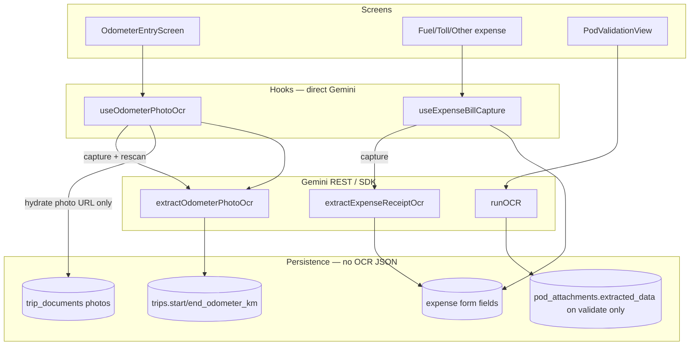
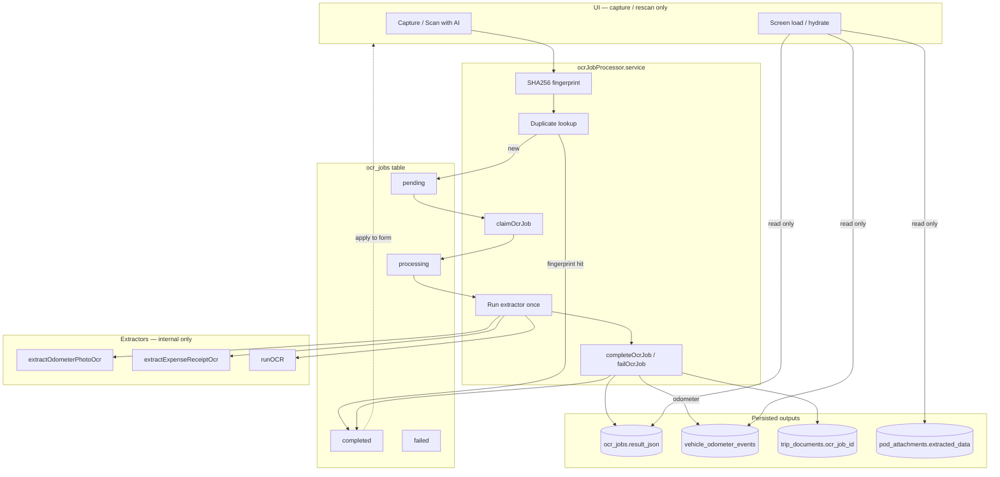

# OCR Pipeline Architecture

Persist-once OCR with a database-backed job queue. Gemini vision runs **only** at capture / explicit rescan — never on screen load.

## Before (client-only, ephemeral)



### Problems

| Issue | Impact |
|-------|--------|
| OCR results only in React state | Lost on navigation; re-scan risk |
| `rescanPhoto()` re-called Gemini | Duplicate API cost |
| No fingerprint dedup | Same file processed multiple times |
| No job status / metrics | No ops visibility |
| POD OCR only on button (OK) but not in shared queue | Inconsistent architecture |

### Removed execution paths

| Path | File | Trigger | Status |
|------|------|---------|--------|
| Direct odometer OCR on capture | `useOdometerPhotoOcr` → `extractOdometerPhotoOcr` | Photo capture | **Routed through `enqueueAndProcessOcrJob`** |
| Direct odometer OCR on rescan | `useOdometerPhotoOcr.rescanPhoto` | User rescan | **Gated by `canRequestOcrRescan` + job queue** |
| Direct expense OCR on capture | `useExpenseBillCapture` → `extractExpenseReceiptOcr` | Bill capture | **Routed through job queue** |
| Direct POD OCR | `PodValidationView` → `runOCR` | Scan with AI button | **Routed through job queue** |
| *(none)* | `useHydrateOdometerPhotos` | Page load | **Never ran OCR** — now loads `ocr_jobs` only |
| *(none)* | Expense edit hydrate | Page load | **Never ran OCR** — unchanged |

**Verified:** No `useEffect`, query hook, RPC, or realtime subscription in the codebase calls `extractOdometerPhotoOcr`, `extractExpenseReceiptOcr`, or `runOCR` on mount. Gemini is only invoked from `features/ocr/services/ocrJobProcessor.service.ts`.

### Phase 2 (expense lineage + dashboard)

- `trip_fuel_entries.ocr_job_id`, `trip_toll_entries.ocr_job_id`, `trip_other_expenses.ocr_job_id` → FK to `ocr_jobs`
- Save mutations persist `ocrJobId` from bill capture; edit screens hydrate via `hydratePersistedOcrFromJob()` (read-only, no Gemini)
- `ocr_jobs.engine_name`, `engine_version`, `prompt_version` stored on enqueue
- Workspace → **Pulse Scan usage** panel (`get_ocr_metrics` RPC): scans today/month, dedup savings, failures, avg confidence, quota remaining

---

## After (persisted job queue)



---

## Database

| Object | Purpose |
|--------|---------|
| `ocr_jobs` | Queue: `pending` → `processing` → `completed` \| `failed` |
| `vehicle_odometer_events` | One persisted odometer reading per OCR job (start/end) |
| `trip_documents.ocr_job_id` | Links uploaded photo → completed job |
| `get_ocr_metrics(org_id, days)` | Jobs/day, avg duration, failures, duplicates |

### Job row fields

- `document_fingerprint` — SHA256 of file bytes
- `engine_version` — `odometer-v1`, `expense-receipt-v1`, `pod-document-v1`
- `confidence_score` — primary field confidence (0–1)
- `result_json` — structured extraction
- `is_duplicate` / `duplicate_of_job_id` — fingerprint collision audit

### Rescan policy (`canRequestOcrRescan`)

Allowed when:

1. User explicitly requests rescan
2. `confidence_score < 0.55`
3. `engine_version` changed
4. Prior job `failed`

Otherwise UI reopens persisted review — **no Gemini call**.

---

## Client module

```
features/ocr/
├── constants/ocr.constants.ts    # engine versions, thresholds
├── types/ocr.types.ts
├── utils/ocrRescan.util.ts
├── services/
│   ├── ocrJob.service.ts         # CRUD, claim, metrics
│   ├── ocrJobProcessor.service.ts # enqueue + process (sole Gemini entry)
│   └── vehicleOdometerEvent.service.ts
└── index.ts
```

### Consumer rules

| Surface | Read | Write OCR |
|---------|------|-----------|
| Odometer screens | `loadPersistedOcrJob` / `hydratePersistedOcr` | `enqueueAndProcessOcrJob` on capture |
| Driver expenses | `hydratePersistedOcr` | `enqueueAndProcessOcrJob` on capture |
| POD reconciliation | `getOcrJobForPodAttachment` + `extracted_data` | `enqueueAndProcessOcrJob` on Scan with AI |
| Dashboards / reports | Query `ocr_jobs`, `vehicle_odometer_events` | Never |

---

## Metrics (`get_ocr_metrics`)

- **jobs_today** — OCR jobs created today
- **jobs_in_window** — jobs in last N days
- **avg_duration_ms** — mean `processing_duration_ms` for completed jobs
- **failed_count** — failed jobs in window
- **duplicate_count** — jobs with `is_duplicate = true`

---

## Migration

Apply: `supabase/migrations/20261001000003_ocr_job_queue_foundation.sql`

```bash
npm run db:push
```
