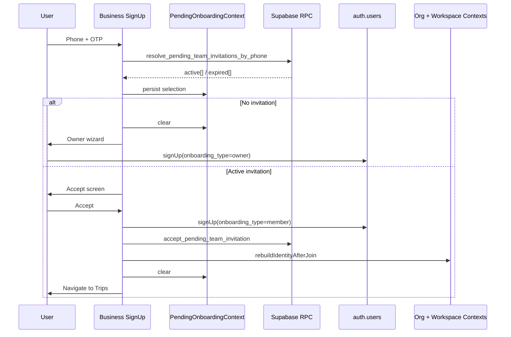

# Team Invitation Onboarding Architecture

Single authentication/onboarding flow with a central **Invitation Resolver** after OTP verification.

## Problem (before)

1. Admin creates `organization_team_invites` (phone) or `organization_members` (existing user).
2. Invitee signs up through the owner onboarding wizard.
3. `handle_new_user` always created a new organization + owner membership.
4. Pending invitations were never explicitly consumed.

## Target flow

```
Entry (Hub / SMS / Email / QR / Deep Link / future SSO)
  ↓
Identity verification (OTP, magic link, password, Google, Entra, Okta, …)
  ↓
resolveInvitationsByIdentities({ identities })   ← channel-agnostic resolver
  ↓
resolveOnboardingContext() → domain context → UI mapper
  ↓
Persist selection     ← PendingOnboardingContext (AsyncStorage)
  ↓
┌──────────────────────────┐
│ Invitation exists?        │
└──────────────────────────┘
       │              │
      Yes             No
       │              │
       ▼              ▼
Accept Invite     Create Organization (onboarding_type: owner)
       │              │
       └──────┬───────┘
              ▼
    rebuildIdentityAfterJoin
              ▼
         Home / Trips
```

**V1 today:** entry is phone + OTP; resolver passes `[{ type: 'phone', value, verified: true }]` into the same pipeline.

## Resolver context (source of truth after OTP)

`resolveOnboardingContext()` in `lib/onboarding/onboardingContext.ts` returns:

| `onboardingType` | Screen |
|------------------|--------|
| `owner` | Org onboarding wizard |
| `team` | New account — accept invitation |
| `existing_member` | Sign in → auto-accept → workspace |
| `multiple_invites` | Org picker |
| `no_invitation` | No invite found |
| `expired_invites` | Expired invitation |

**URL `intent=team`** affects only pre-OTP UX (copy, hide Google). After OTP, routing uses resolver output only.

**Zero-invite disambiguation:** `entryHint=team` → `no_invitation`; default → `owner`.

## Deep links (one pipeline)

All converge on `/onboarding/business` with UX hint:

- `?intent=team` — hub “Join your company”
- `?invite=team` — SMS/email invite links
- `?ref=team-invite` — QR / campaign refs
- `/onboarding/join-team` — redirects to business + `intent=team`

## Analytics (`lib/onboarding/onboardingAnalytics.ts`)

Dev console events: `join_company_started`, `owner_signup_started`, `otp_verified`, `invitation_found`, `multiple_invitations`, `existing_account`, `existing_account_signed_in`, `invitation_accepted`, `no_invitation`, `owner_signup`, `invitation_expired`.

## Existing account flow

Phone → OTP (not blocked) → resolver → `existing_member` → password → sign in → `completeTeamJoinAfterAuth` (phone invite or membership) → identity rebuild → Trips.


## Related

- [PLATFORM_IDENTITY.md](./PLATFORM_IDENTITY.md) — bounded `platformIdentityService` façade, policy engine v1, workspace, audit

---

## Status (V1 — complete)

| Deliverable | State |
|-------------|--------|
| Single onboarding pipeline | Done |
| Single OTP verification | Done |
| Resolver is authority after OTP | Done |
| `intent` / deep links affect UX only | Done |
| Multiple invitations (picker) | Done |
| Existing-account continuation (no sign-in dead-end) | Done |
| Deep links converge on `/onboarding/business` | Done |
| Analytics hooks (`onboardingAnalytics.ts`) | Done |
| Documentation | Done |

**Deferred (incremental PRs):**

- `platform.invitations` replacing `organization_team_invites` (RPC backing store)
- Email / IdP `IdentityProvider.resolveInvitations()` implementations
- API gateway instead of direct RPC from UI
- SSO / Entra / Okta verification steps in the signup screen
- Org policy enforcement in UI (collect only required identities)
- `platform.organization_identity_policies` backing store

**Partially landed (V2 architecture layer — no UI change):**

- Discriminated `InvitationIdentity` union (`PhoneIdentity`, `EmailIdentity`, `EmployeeIdentity`, `ExternalIdentity`)
- `IdentityInvitation` model with multi-identity matching
- `IdentityProvider` registry (`phone`, `email`, `employee_id`, `sso`) — phone implemented
- `resolveInvitationsByIdentities()` via providers (never assumes phone mandatory)
- `runOnboardingResolverPipeline()` — invitations → memberships → org policy → domain
- `OrganizationIdentityPolicy` + `loadOrganizationIdentityPolicy()` stub
- `RelationshipType` + `MembershipLifecycleStatus` + `PersonStatus`
- `evaluateMembershipPolicy()` policy engine with `requiredActions`
- `OrganizationEmploymentPolicy` (per-org, `allowDualEmployment`)
- `proposedRelationshipType` on invitations (role assigned later)
- Separate `invitationPicker` / `workspaceSwitcher` / policy engine modules
- `OnboardingDomainContext` + `mapDomainContextToUi()` — three-layer pipeline
- `completeOnboarding()` / `completeOnboardingAfterJoin()` — shared post-join orchestration
- Entry channel taxonomy (`onboardingEntryChannels.ts`)

---

## V2 direction — multi-channel identity

Enterprise onboarding supports many **identity channels** and **verification methods** through one pipeline. The resolver does not care whether identity came from phone or email.

### Identity channels (entry)

| Channel | V1 | Notes |
|---------|----|-------|
| Join Company (hub) | Yes | `intent=team` |
| Transport Business (hub) | Yes | default owner path |
| Email invite link | UX only | converges on `/onboarding/business` |
| SMS invite link | UX only | `?invite=team`, `?ref=team-invite` |
| QR invite | UX only | deep link ref |
| Deep link | Yes | `signupEntryIntent.ts` |
| SSO | Future | Microsoft / Okta / Google Workspace |
| Corporate directory | Future | employee_id lookup |

`intent=team` remains a **presentation hint** only. Business routing is always `resolveOnboardingContext()` after verification.

### Identity verification (post-entry)

| Method | V1 | Future |
|--------|----|--------|
| Phone OTP | Yes | |
| Email magic link / OTP | | Enterprise invites |
| Password | Partial | existing-account path |
| Google | Owner path | |
| Microsoft Entra ID | | Corporate email → verified email → resolver |
| Okta | | Same pattern |
| SAML / OIDC | | Same pattern |

### Pipeline (full resolver)

```
Entry (Hub, SMS, Email, QR, Deep Link, Corporate Portal, Entra, Okta, HR Directory, …)
        │
        ▼
 Identity verification (Phone OTP, Email OTP, Magic Link, Entra, Google, Okta, Auth0, SAML, Employee ID)
        │
        ▼
 resolveInvitationsByIdentities()  ← IdentityProvider registry (phone today)
        │
        ▼
 resolveMembershipsByIdentities()
        │
        ▼
 loadOrganizationIdentityPolicy()
        │
        ▼
 buildOnboardingDomainContext()
        │
        ▼
 mapDomainContextToUi()  →  Appropriate screen
        │
        ▼
 completeOnboarding()  →  accept (if needed) + refresh identity + navigate
```

The pipeline **never assumes phone is mandatory**. Enterprise orgs may disable phone entirely (`requireSso: true`, `allowedProviders: ['entra']`).

### Discriminated identity types

```typescript
type InvitationIdentity =
  | { type: 'phone'; value: string; verified: boolean }
  | { type: 'email'; value: string; verified: boolean; domain?: string }
  | { type: 'employee_id'; value: string; verified: boolean }
  | { type: 'external_identity'; provider: 'entra' | 'google' | 'okta' | 'auth0' | 'saml'; subject: string; verified: boolean };
```

A user may hold **multiple verified identities** simultaneously (phone + email + Entra oid + employee ID).

### Invitation model (IdentityInvitation)

```typescript
interface IdentityInvitation {
  id: string;
  organizationId: string;
  accepted: boolean;
  expiresAt: string; // ISO-8601
  identities: InvitationIdentity[];  // phone + email + employee_id on same invite
  // V1 presentation: inviteeName, role, businessUnit, department, …
}
```

Resolver succeeds if **any verified identity matches any invitation identity** (`invitationMatchesVerifiedIdentities()`).

### IdentityProvider abstraction

```typescript
interface IdentityProvider {
  type: 'phone' | 'email' | 'employee_id' | 'external_identity';
  supports(identity): boolean;
  verify(input): Promise<VerifiedIdentity>;
  resolveInvitations(identity): Promise<IdentityInvitation[]>;
}
```

| Provider | File | V1 |
|----------|------|-----|
| Phone | `phoneIdentityProvider.ts` | Implemented (OTP in UI, RPC resolve) |
| Email | `emailIdentityProvider.ts` | Stub |
| Employee ID | `employeeIdentityProvider.ts` | Stub |
| SSO (Entra, Google, Okta, Auth0, SAML) | `ssoIdentityProvider.ts` | Stub |

Register new providers via `registerIdentityProvider()` — core pipeline unchanged.

### Organization identity policy

Policy belongs to the **organization**, not the onboarding flow:

```typescript
interface OrganizationIdentityPolicy {
  allowedProviders: ('phone' | 'email' | 'entra' | 'google' | 'okta' | 'employee_id')[];
  requirePhone: boolean;
  requireCorporateEmail: boolean;
  requireSso: boolean;
  corporateEmailDomain?: string;
}
```

Examples:

- **ABC Logistics** — Entra only, no phone: `{ allowedProviders: ['entra'], requireSso: true }`
- **Strict enterprise** — phone AND corporate email: `{ requirePhone: true, requireCorporateEmail: true }`

V1 uses `DEFAULT_ORGANIZATION_IDENTITY_POLICY` until `platform.organization_identity_policies` exists. `missingRequiredIdentities()` gates future verification steps.

### Resolver API

**V1 (deprecated alias):** `resolveTeamInvitationsByPhone(phone)`

**V2 contract:**

```typescript
resolveInvitationsByIdentities({
  identities: [
    { type: 'phone', value: '+919876543210', verified: true },
    { type: 'email', value: 'john@company.com', verified: true },
  ],
});
```

The resolver can match against phone, email, corporate email, employee ID, Entra object ID, Google Workspace account, etc. **without changing mobile UI** — new providers plug into `identityProviders/`.

V1 phone RPCs (`resolve_pending_team_invitations_by_phone`) remain the backing store until Platform Identity migration.

### Complete onboarding orchestration

All scenarios end with the same orchestrator (`completeOnboarding.util.ts`):

```
accept invitation (when required)
  → refresh Platform Identity (session)
  → refresh memberships / organizations
  → switch organization/workspace
  → rebuild caches
  → clear pending onboarding
  → navigate
```

- `completeOnboarding({ inviteId })` — invite accept + shared rebuild (V1 team join)
- `completeOnboardingAfterJoin(organizationId)` — owner provisioning / org switch (future)

`useCompleteInvitationJoin` delegates to `completeOnboarding()` — behavior unchanged.

### Platform Identity domain model (target)

```
Person
│
├── Identities
│     ├── Phone
│     ├── Email
│     ├── Employee ID
│     └── SSO Identity
│
├── status                    ACTIVE | SUSPENDED | DELETED | LOCKED
│
└── Memberships
      ├── Organization
      ├── relationshipType    EMPLOYEE | CONTRACTOR | PARTNER | SUPPORT | SYSTEM
      ├── role                Driver, Auditor, Insurance Surveyor, Consultant, …
      ├── lifecycleStatus     PENDING | ACTIVE | SUSPENDED | TERMINATED | …
      └── permissions
```

**Key separation:**

| Dimension | Evaluated by | Examples |
|-----------|--------------|----------|
| `relationshipType` | Membership policy engine | EMPLOYEE, CONTRACTOR, PARTNER |
| `role` | Authorization / permissions | Driver, Insurance Surveyor, Consultant |
| `lifecycleStatus` | Policy engine (ACTIVE only for employment) | PENDING → ACTIVE → TERMINATED |

An insurance surveyor may be `EMPLOYEE` of an insurer, `CONTRACTOR` at a fleet, or self-employed — **relationship type ≠ job title**.

### Relationship types (policy dimension)

```typescript
type RelationshipType = 'EMPLOYEE' | 'CONTRACTOR' | 'PARTNER' | 'SUPPORT' | 'SYSTEM';
```

Employment policy evaluates `relationshipType === 'EMPLOYEE'` only — not business role.

### Membership lifecycle

```typescript
type MembershipLifecycleStatus =
  | 'PENDING' | 'ACTIVE' | 'SUSPENDED' | 'TERMINATED' | 'DECLINED' | 'EXPIRED';
```

Employment policy considers **ACTIVE** only — historical TERMINATED memberships do not block new invites.

### Person status

```typescript
type PersonStatus = 'ACTIVE' | 'SUSPENDED' | 'DELETED' | 'LOCKED';
```

Disables access across **all** organizations without mutating every membership (fraud, compliance, enterprise admin).

### Organization employment policy

Per-organization — not a global constant:

```typescript
employmentPolicy: {
  maxActiveEmploymentMemberships: 1,  // 99% of orgs
  allowDualEmployment: false,
}
```

Future marketplace orgs may set `2` or `allowDualEmployment: true` without redesign.

### Membership policy engine

`evaluateMembershipPolicy()` in `membershipPolicyEngine.ts` — extensible structured result:

```typescript
{
  allowed: false,
  reason: 'ACTIVE_EMPLOYMENT_EXISTS',
  blockingMembership: { ... },
  requiredActions: ['LEAVE_ORGANIZATION'],
}
```

Future rules plug in here: expired invite, SSO required, corporate email, contractor approval, suspended org, HR approval — **without changing onboarding UI**.

`validateInvitationAcceptance()` is a deprecated alias.

### Invitations → relationships

```typescript
interface IdentityInvitation {
  proposedRelationshipType: RelationshipType;  // was membershipType
  role?: string;  // may be assigned after accept (enterprise)
}
```

Large enterprises invite first, assign department/role after onboarding.

### Three independent utilities (never share code)

| Utility | Module | Purpose |
|---------|--------|---------|
| Invitation picker | `invitationPicker.util.ts` | Choose pending invite to accept |
| Workspace switcher | `workspaceSwitcher.util.ts` | Switch active org among memberships |
| Policy engine | `membershipPolicyEngine.ts` | Evaluate accept / employment rules |

### Invitation acceptance flow

```
Resolve person (+ person status)
        ↓
Load existing memberships (lifecycle-normalized)
        ↓
Load organization employment policy
        ↓
evaluateMembershipPolicy()
        ↓
  ACTIVE EMPLOYEE elsewhere? → reject + LEAVE_ORGANIZATION
  else → accept → completeOnboardingAfterJoin
```

### Onboarding completion flow

```
Verify identity
        ↓
Resolve invitation
        ↓
evaluateMembershipPolicy()   ← org employment policy + person status
        ↓
Accept invitation
        ↓
Create membership (relationshipType; role may follow)
        ↓
Set current organization
        ↓
Enter workspace

### Domain context (facts)

`OnboardingDomainContext` (`lib/onboarding/onboardingDomainContext.ts`):

```typescript
{
  verifiedIdentities: InvitationIdentity[];
  account: { exists: boolean; email?: string; maskedEmail?: string; userId?: string };
  invitations: { active: IdentityInvitation[]; expired: IdentityInvitation[] };
  memberships: OnboardingMembershipSummary[];
  organizations: { id: string; name: string }[];
  identityPolicy: OrganizationIdentityPolicy;
  membershipPolicy: PlatformMembershipPolicy;
  person: PlatformPersonDomain;
  entryHint: 'owner' | 'team';
  entryChannel?: OnboardingEntryChannel;
}
```

`mapDomainContextToUi()` produces the V1 enum (`owner`, `team`, `existing_member`, …) so **screens are unchanged**. Rich combinations (account exists + 3 invites + active membership) are expressed in domain context, not new enum values.

### Enterprise flow (no phone required)

```
Employee receives invite (email)
        │
        ▼
Corporate email on invitation
        │
        ▼
Microsoft Login (future)
        │
        ▼
Verified email identity
        │
        ▼
resolveInvitationsByIdentities({ identities: [{ type: 'email', value, verified: true }] })
        │
        ▼
Join company (same accept + rebuildIdentityAfterJoin path)
```

Okta, Google Workspace, and Azure AD fit the same resolver once IdP verification adds `external_identity` or verified `email` to `verifiedIdentities`.

### Module map (V2 layer)

| Module | Role |
|--------|------|
| `identityTypes.ts` | Discriminated `InvitationIdentity`, `IdentityInvitation`, match helpers |
| `organizationIdentityPolicy.ts` | Per-org policy + `missingRequiredIdentities()` |
| `identityProviders/` | `IdentityProvider` registry (phone implemented) |
| `onboardingInvitationResolver.ts` | `resolveInvitationsByIdentities()` via providers |
| `onboardingMembershipResolver.ts` | Membership resolve stub |
| `onboardingResolverPipeline.ts` | Full pipeline orchestrator |
| `onboardingDomainContext.ts` | Domain facts builder |
| `mapDomainContextToUi.ts` | UI mapper (V1 enum) |
| `completeOnboarding.util.ts` | Shared post-join orchestration |
| `onboardingContext.ts` | `resolveOnboardingContext()` entry |
| `invitationModel.util.ts` | V1 row ↔ `IdentityInvitation` adapters |
| `teamInvitationResolver.service.ts` | V1 phone RPCs + accept (unchanged) |

### Migration path

1. **Done:** V1 enum mapper kept; domain layer + IdentityProvider registry added — no breaking change.
2. **Done:** `completeOnboarding()` shared orchestration; `useCompleteInvitationJoin` delegates.
3. **Next:** Implement `emailIdentityProvider.resolveInvitations` + email verification.
4. **Next:** `ssoIdentityProvider` for Entra / Google / Okta.
5. **Platform Identity:** `platform.invitations` + `platform.organization_identity_policies`.

---

## Onboarding intent (not skip flags)

| `onboarding_type` | `handle_new_user` behavior |
|-------------------|----------------------------|
| `owner` (default) | Create org + owner membership |
| `member` | Profile only; join via `accept_pending_team_invitation` |
| `guest`, `contractor`, `partner`, `supplier` | Reserved; same as member today |

Legacy `skip_org_creation=true` still maps to `member` for backward compatibility.

Client: `lib/onboarding/onboardingTypes.ts` · `auth.service.ts` sets `onboarding_type` in signUp metadata.

**Why not `skip_org_creation` long-term:** skip-flags multiply (`skip_branding`, `skip_billing`, …). Intent scales cleanly.

## Resumable pending invitation

`PendingOnboardingContext` + `@pulse_pending_onboarding_v1` in AsyncStorage:

- Persists phone, resolver result, selected invite, phase (`picker` | `accept` | `expired`)
- Survives app restart before auth completes
- Cleared after successful join or when user chooses owner onboarding
- Future: deep links, email invites, multi-org picker resume

## Post-accept identity rebuild

After `accept_pending_team_invitation()` the app must not navigate with stale org/workspace state.

`rebuildIdentityAfterJoin` (`lib/onboarding/rebuildIdentityAfterJoin.util.ts`):

1. `refreshSession()` — auth + profile
2. `refreshOrganization()` — OrganizationContext
3. `refreshWorkspaces()` — ActiveWorkspaceContext
4. `switchWorkspace(organizationId)` — active org
5. Evict TanStack Query cache (`q.*` keys)
6. `clearPending()` — pending onboarding storage

Wired via `useCompleteInvitationJoin` in the signup accept handler.

## Sequence diagram



## Tables (current → future)

| Today | Future (Platform Identity) |
|-------|----------------------------|
| `organization_team_invites` | `platform.invitations` |
| `organization_members` | `platform.memberships` |
| `organizations` | `platform.organizations` |
| Role in `permissions.platformRole` | `platform.roles` + `platform.permissions` |

Phone invites remain on `organization_team_invites` until `platform.invitations` is bridged. Resolver RPC can later union both sources without changing the client flow.

## Database changes

| Migration | Purpose |
|-----------|---------|
| `20261107010000_organization_team_phone_invites.sql` | Phone invite table + admin RPCs |
| `20261107020000_team_invitation_resolver.sql` | Resolver + idempotent accept RPCs |
| `20261107030000_onboarding_type_intent.sql` | `handle_new_user` switches on `onboarding_type` |

## API / service layer

| Module | Role |
|--------|------|
| `identityTypes.ts` | Discriminated identities + `IdentityInvitation` |
| `identityProviders/` | Pluggable verify + resolve per channel |
| `membershipTypes.ts` | `RelationshipType`, lifecycle, `PersonStatus` |
| `platformMembership.ts` | Membership model (relationship ≠ role) |
| `organizationEmploymentPolicy.ts` | Per-org `maxActiveEmploymentMemberships` |
| `membershipPolicyEngine.ts` | `evaluateMembershipPolicy()` |
| `invitationPicker.util.ts` | Pending invite picker (isolated) |
| `workspaceSwitcher.util.ts` | Workspace switcher (isolated) |
| `platformIdentityDomain.ts` | User → Identity + Membership domain snapshot |
| `organizationIdentityPolicy.ts` | Per-org allowed providers + requirements |
| `onboardingResolverPipeline.ts` | Full resolve pipeline |
| `onboardingInvitationResolver.ts` | Provider-based invitation resolve |
| `completeOnboarding.util.ts` | Shared post-join orchestration |
| `onboardingDomainContext.ts` | Domain facts after resolve |
| `mapDomainContextToUi.ts` | Domain → V1 UI enum |
| `onboardingContext.ts` | `resolveOnboardingContext()` orchestrator |
| `onboardingTypes.ts` | Intent types + `createsOrganization()` |
| `teamInvitationResolver.service.ts` | V1 phone RPCs + accept |
| `pendingOnboardingStorage.util.ts` | AsyncStorage persistence |
| `rebuildIdentityAfterJoin.util.ts` | Post-accept context rebuild |
| `useCompleteInvitationJoin.ts` | Accept + rebuild + clear pending |
| `auth.service.ts` | `signUp({ onboardingType: 'member' \| 'owner' })` |

## UI flow

| Step | Owner | Invite |
|------|-------|--------|
| 0–1 | Phone, OTP | Phone, OTP → resolver → persist |
| 2 | Org name | Picker / Accept / Expired |
| 3–8 | Company + branding | Skipped |

Components: `InvitePickerStep`, `InviteAcceptanceStep`, `InviteExpiredStep`.

## Migration plan

```bash
npm run db:push
```

1. Apply migrations in order (10000 → 20000 → 30000).
2. Deploy app with `PendingOnboardingProvider` in `_layout.tsx`.
3. Verify: invite → signup → lands in invited org with correct workspace active.

## Rollback

1. **App:** revert to previous signup hook; remove `PendingOnboardingProvider` if needed.
2. **DB:** restore prior `handle_new_user`; drop new RPCs if required. Keep invite table data.
3. **Metadata:** old clients sending `skip_org_creation` still work (mapped to `member`).

## Backward compatibility

- Owner signup unchanged (`onboarding_type: 'owner'` explicit in `createAccount`).
- Legacy `skip_org_creation` honored in trigger.
- Existing `organization_members.status = 'invited'` path unchanged for signed-in users.
