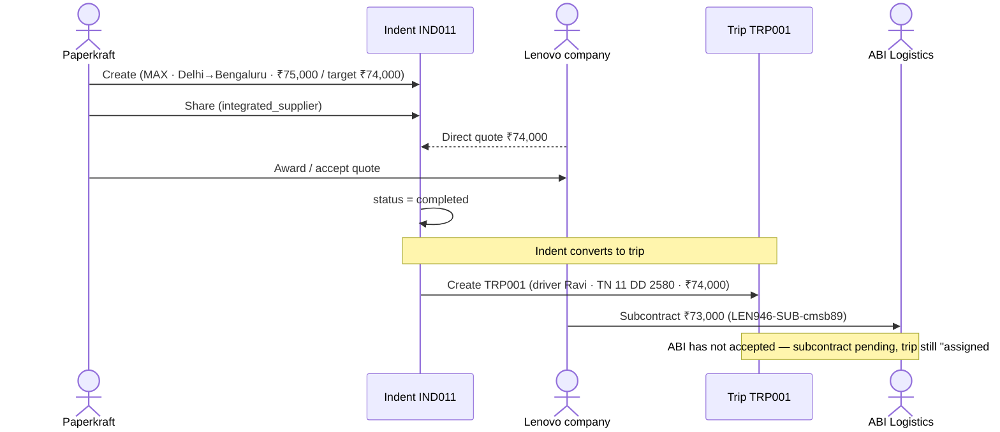

# Indent to Trip (Aggregation) Modal Flow — IND011 (Paperkraft)

Give-load (indent) lifecycle, traced with real data for indent **IND011** created by org **Paperkraft**.

## Indent Data

| Field | Value |
|-------|-------|
| Indent ID | IND011 |
| Internal ID | a1ac315f-581e-4f4c-9b0c-035368308a2a |
| Origin org | Paperkraft |
| Client | MAX |
| Route | Delhi, NCR → Bengaluru, Karnataka |
| Vehicle type | Closed Container |
| Load type | FMCG Goods |
| Weight | 15,000 kg |
| Client price | ₹75,000 |
| Supplier target | ₹74,000 |
| Assigned supplier rate | ₹74,000 |
| Circulation target | integrated_supplier |
| Status | completed |
| Pickup date | 2026-07-23 |
| Shared at | 2026-07-23 05:43:30 UTC |
| Created at | 2026-07-23 05:43:30 UTC |
| Updated at | 2026-07-23 05:51:01 UTC |
| Assigned supplier | 914bf58e-dffa-4f81-b068-be91d1d4c11a |

## Flow Steps

1. **Create** — Paperkraft creates the indent for client MAX (Delhi → Bengaluru, Closed Container, FMCG, 15,000 kg). Client price ₹75,000, supplier target ₹74,000.
2. **Share / Broadcast** — Indent shared to `integrated_supplier` circulation target at 05:43:30 (`shared_at` = `created_at`, so shared on creation).
3. **Assign supplier** — Supplier `914bf58e…` assigned at ₹74,000 (matches supplier target — margin ₹1,000).
4. **Quote / Bid** — This indent went out as a direct quote (circulation `integrated_supplier`), not an open broadcast, so there are no `bids` rows. One direct quote was received:

   | Bidder org | Amount | Status | Quoted at |
   |------------|--------|--------|-----------|
   | Lenovo company | ₹74,000 | accepted | 2026-07-23 05:44:31 UTC |

5. **Award** — Paperkraft awarded/accepted **Lenovo company**'s quote of ₹74,000 (matches the supplier target; margin ₹1,000). Accepted at 05:51:01 UTC — the same moment the indent flipped to `completed`, and Lenovo is the assigned supplier (`914bf58e…`).
6. **Complete** — Status moved to `completed` at 05:51:01 (~7.5 min after creation).

## What Lenovo did after being awarded

7. **Trip created** — On award, the indent converted into trip **TRP001** (org Paperkraft) at 05:51:01 UTC, supplier rate ₹74,000. Driver **Ravi**, vehicle **TN 11 DD 2580**. Status `assigned`, payment `pending`.
8. **Subcontracted** — ~4 seconds later (05:51:05 UTC), Lenovo subcontracted the trip to **ABI Logistics** (on-platform) at **₹73,000**, sub-trip code `LEN946-SUB-cmsb89`. Subcontract status `pending`.

### Current state (as of query)

- Trip TRP001 is still `assigned` / payment `pending` — no status changes, no location checkpoints, no documents recorded yet.
- Lenovo's margin on the subcontract: ₹74,000 − ₹73,000 = **₹1,000**.

## Sequence Diagram

## Award Summary

- **Who bid:** Lenovo company (single direct quote) — ₹74,000
- **Who was awarded:** Lenovo company — ₹74,000, accepted
- **What Lenovo did:** created trip TRP001 (driver Ravi, TN 11 DD 2580), then subcontracted to ABI Logistics at ₹73,000

> Data current as of query on 2026-07-23. Only one indent exists from org Paperkraft.
